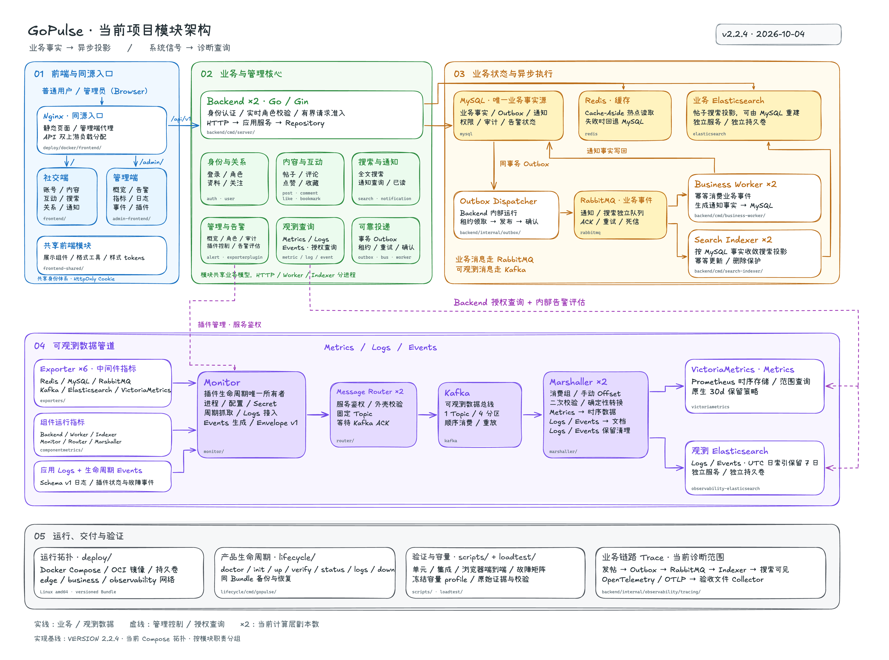

# GoPulse 当前项目模块架构图

本页是实现快照；整体、业务和可观测的未来模块拆分见[目标架构图解](target-architecture/README.md)。
两类图的用途与文档入口见[文档导航](../../../docs/README.md)。

基于当前工作区的已完成产品版本 `2.2.4`，绘制日期为 2026-10-04。
使用 Excalidraw 原生元素和导出器生成，中文与英文采用手绘字体。

- [高清 PNG](gopulse-modules.png)：4608 × 3424，可用于阅读与分享。
- [矢量 SVG](gopulse-modules.svg)：可放大查看模块文字和连线。
- [可编辑 Excalidraw 源文件](gopulse-modules.excalidraw)：可在 Excalidraw 中打开并调整。

## AI 图 v2（实现快照）

- [AI 图片 v2](gopulse-modules-ai-v2.png)：`2.2.4` 模块概览，1536 × 1024。
- [生成、修正与目视检查记录](gopulse-modules-ai-v2-prompt.md)：保留实际绘图过程与已知图形局限。

## 图的含义与依据

图按前端与入口、业务与管理核心、业务状态与异步执行、可观测数据管道、运行交付与验证分组。
实线表示业务或观测数据流，虚线表示管理控制或授权查询，`×2` 表示当前计算层副本数。
图中 Backend 内部的业务卡片是模块，Outbox Dispatcher 也在 Backend 内运行；
Business Worker 和 Search Indexer 是同一业务代码库的独立运行进程。
Search Indexer 根据 MySQL 事实收敛业务 Elasticsearch 投影，该数据库读取关系写在卡片内。

实现事实核对来源：

- [当前版本](../../../VERSION)与[能力状态](../../status/capability-status.md)。
- [当前部署拓扑](../../../deploy/compose.yaml)与[同源入口配置](../../../deploy/docker/frontend/nginx.conf)。
- [Backend API 模块](../../../backend/internal/http/api.go)、[组件指标库](../../../componentmetrics)、[Exporter 模块](../../../exporters)。
- [Monitor](../../../monitor)、[Router](../../../router)、[Marshaller](../../../marshaller)、[生命周期工具](../../../lifecycle)。

目标对照依据：[高并发设计](<../../../docs/GoPulse 高并发架构设计.md>)与
[可观测设计](<../../../docs/GoPulse 可观测架构设计.md>)共同负责未来架构，不能用目标替代上面的实现事实。

此图描述当前 Compose 实现。Trace 卡片限定为已实现的单业务链路与验收文件 Collector。
长期 Trace 查询与部署平台扩展尚未成为当前已验证能力；是否进入实施须形成正式合同，不能从图中推定。
