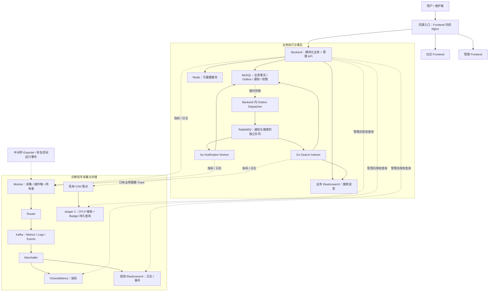
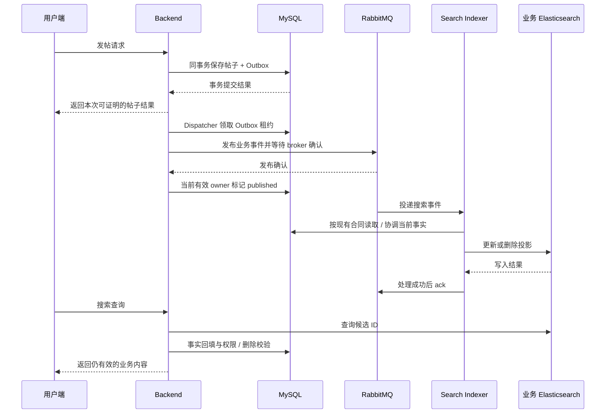
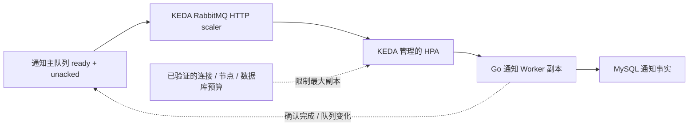

# GoPulse 顶层架构与全局发展总纲

> 决策日期：2026-10-03；已完成产品基线：根 `VERSION=2.2.4`。
> 本文件是唯一全局发展总纲，决定产品终态、系统边界、架构取舍和演进顺序。
> 图中的目标架构包含尚未实现的能力；当前事实见[能力清单](../status/capability-status.md)。
> Phase 20 的已有合同、停点、预算和证据保持不变，本次设计不恢复其执行。

阅读顺序：先读第 1～4 节，理解项目最后长什么样以及现在要改变什么；
第 5～10 节解释各条链路怎样协作；第 11～13 节说明怎样到达终点。
批次、版本、命令和数值门禁由实施方案负责，不在这里重复分配。

## 1. 一句话定义最终产品

**GoPulse 最终是一个可以实际使用、可以诊断问题、可以在 Kubernetes 上运行，
并且能用真实业务解释并发与扩缩容的 Go 社交系统。**

用户在社交端发帖、关注、评论、点赞、搜索和查看通知。
维护者在管理端看到请求、后台任务和运行实例的状态，能够沿着证据找到等待或失败发生的位置。
学习者运行同一个系统，改变流量、停止消费者或更新 Pod，观察设计为什么有效、又在哪里失效。

项目的价值在于把 **Go 程序、事务、缓存、消息队列、搜索、观测与容器运行之间的关系**
做成可以运行和解释的完整系统。已有中间件负责通用存储和运输；GoPulse 负责业务语义、
可靠协作、诊断体验以及交付整合。业务和自研观测都是一等能力。

最终公开交付包含五项成果：

| 使用者拿到什么 | 能做成什么 |
| --- | --- |
| 社交端 | 使用已有内容、关系、互动、搜索和通知功能 |
| 诊断管理端 | 从慢请求、异步延迟或实例异常进入相关指标、日志、Trace 和运行事件 |
| Compose Bundle 与 Helm 交付 | 在明确支持的环境安装、升级、保留数据和恢复 |
| 三个代表性并发案例与通知伸缩案例 | 看懂流量、拒绝、积压、数据库负担和副本变化之间的关系 |
| 中文架构说明与运行实验 | 非作者能复现现象，并解释收益、代价和适用边界 |

产品建设与学习材料共同交付。教程依托真实产品行为，业务功能也承担真实一致性与权限责任。
完成这些成果后进入维护，停止自动追加架构主线。

## 2. 最终架构的七个明确决定

| 决定 | 选定架构 | 选择原因与承担的代价 |
| --- | --- | --- |
| 业务怎么组织 | Go 模块化单体，共享一套业务模型；HTTP、通知和搜索按运行职责分进程 | 保留本地事务与较低维护成本，仍可分别扩容；共享 MySQL 是容量与可用性边界 |
| 数据由谁负责 | MySQL 保存业务事实；Redis 是缓存；业务 Elasticsearch 是可重建搜索投影 | 删除、权限和业务存在性有唯一依据；缓存命中和搜索命中仍可能需要 MySQL 校验 |
| 后台任务怎样可靠完成 | 同事务 Outbox → RabbitMQ → 幂等通知 Worker / 收敛 Search Indexer | 提交后可恢复处理；接受重复投递，不承诺消息恰好投递一次 |
| 自研观测保留什么 | Monitor → Router → Kafka → Marshaller → VictoriaMetrics / 观测 Elasticsearch | 保留采集、运输、转换的学习深度；承担信号生命周期、身份和资源治理成本 |
| Trace 怎么补齐 | 现有 OTel 埋点直接以 OTLP 写入单实例 Jaeger 2，内嵌 Badger + 独立持久卷 | 获得持久查询，避免自研 Trace 库；接受单节点与有限保留能力 |
| 云原生怎么交付 | 保留 Compose，新增一套 Linux `amd64` 学习集群配置与一个 Helm 产品入口 | 同一产品有两个部署适配；首轮明确支持一种环境，状态服务先单实例 |
| 哪部分自动伸缩 | Go 通知 Worker 使用 KEDA，其他计算进程先手动扩缩容 | 先把一个控制闭环做正确；副本上限受数据库、节点和消息处理能力共同约束 |

业务服务与通知消费者统一使用 Go。前端沿用 TypeScript / Vue 3，运维脚本沿用既有工具。
不新增另一种业务语言、替代消费者或另一套业务运行逻辑。

## 3. 目标系统全景

图中实线表示业务或观测数据流，虚线表示采集、授权查询或诊断关联。
这是整体目标，Jaeger 产品查询、完整实例关联、Helm 和 KEDA 尚未完成。



Kubernetes 负责运行这些进程、替换实例和执行部署策略；KEDA 只控制通知 Worker 的副本数。
它们不接管业务事务、消息确认或插件所有权。

三个系统边界贯穿整张图：

1. **执行业务**：Backend、Worker、Indexer 与业务存储负责用户事实及其异步结果。
2. **解释业务**：观测链路收集诊断信号，Backend 授权查询，管理端组织证据。
3. **运行系统**：Compose / Kubernetes 启动同一组制品，管理配置、持久化、探针和实例生命周期。

这三个边界仍共享机器、网络及部分依赖。进程分离可以缩小故障传播，无法消除宿主机资源竞争；
管理端实时授权依赖 MySQL，不能宣称在业务数据库故障时仍然独立可用。

## 4. 从当前系统到目标系统，具体改变哪里

| 模块 | 当前已有基础 | 后续真正改变的部分 | 用户可见的结果 |
| --- | --- | --- | --- |
| 业务核心 | 账号、内容、关系、互动、通知、搜索；事务 Outbox、缓存与删除保护 | 按既有 Phase 20 合同处理已暴露的写响应一致性失败；后续仅针对已证实的代表性瓶颈优化 | 接受事实与响应结果有可核对关系，压力下的行为可以解释 |
| 多副本观测 | 计算层双副本、逐端点抓取、运行日志身份 | 把实例及进程生命周期身份贯通采集、Envelope、转换、存储、API 与页面 | 知道慢的是哪个副本，重启前后不混成一条连续计数器 |
| Trace | 发帖到搜索的 OTel 传播、验收用文件 Collector | Jaeger 持久化、受限查询适配、日志关联和 Trace 视图 | 从相关请求看到已有链路的等待、处理和重试 |
| 管理端 | 指标、日志、事件、告警、插件和权限页面 | 固定诊断入口、共享上下文、独立查询准入、缺失证据状态 | 排查问题时不用逐页手工拼时间和标识 |
| 部署 | Linux `amd64` Compose、镜像、Bundle、探针、排空、备份恢复 | Helm、集群服务发现、卷与迁移编排、网络策略和运行事件适配 | 同一产品能在指定学习集群安装、更新和恢复 |
| 并发 | 有界请求、连接池、消息缓冲、三重复容量工具和历史结果 | 信息流、热帖、异步突发各一个代表案例；有原因才做一个优化对照 | 看清业务形状和资源条件如何决定瓶颈 |
| 弹性 | Go Worker、幂等通知、多副本与关停 | 手动副本收益对照、通知队列精确度量、KEDA 有限伸缩 | 积压可以触发扩容，维护者知道上限和失效动作 |
| 开源交付 | 已有安装与运行资料、实施记录 | 整合产品入口、诊断案例、迁移恢复手册与学习路径 | 非作者能独立使用和复现 |

当前完成版本仍为 `2.2.4`；Phase-20-05 未完成，06 未开始。
已完成的能力与历史证据继续按原合同成立，新的目标架构不能被写成已经实现。

## 5. 业务核心：保持一个模型，分别扩展运行进程

### 5.1 模块边界与代码落点

业务模块之间使用本地应用接口协作，事务仍在 MySQL 内结束。
HTTP 层处理输入、认证、响应；应用服务组织用例；Repository 负责持久化。
共享 `platform` 提供数据库、缓存、消息客户端，不承载业务规则。
沿用现有目录和接口，按实际变化改善边界，不为图的整齐进行全库重写。

| 模块 | 拥有的业务规则与事实 | 当前代码落点 |
| --- | --- | --- |
| 身份与用户 | 登录、账号、角色、个人资料、关注关系 | `backend/internal/auth`、`user` |
| 内容 | 帖子创建、编辑 revision、删除与相关事实协调 | `backend/internal/post` |
| 互动 | 评论、点赞、收藏及权限 / 存在性约束 | `comment`、`like`、`bookmark` |
| 通知 | 通知事实、已读状态、消息幂等 | `notification`；`cmd/business-worker` |
| 搜索 | 搜索投影、查询分页、索引重建与事实回填 | `search`；`cmd/search-indexer`、`cmd/search-reindex` |
| 可靠投递 | 业务 Envelope、Outbox 租约、发布与消费者确认 | `bus`、`outbox`、`worker` |
| 管理与诊断 | 实时角色校验、查询、告警、插件管理和审计 | `metricquery`、`logquery`、`eventquery`、`alert`、`exporterplugin` |

模块拥有事实写入责任，但关联查询可以复用现有数据库与受限接口；
无需为每张表制造一个网络服务。跨模块的不变量在同一事务内维护，避免由缓存或消息代替权限判断。

### 5.2 运行进程与唯一所有者

| 运行单元 | 做什么 | 扩展方式 / 所有者 |
| --- | --- | --- |
| Backend | HTTP 业务与管理 API；内置 Outbox Dispatcher；现有告警调度 | 多副本；Outbox 与告警按各自 MySQL 租约协调 |
| Notification Worker | 从通知队列生成 MySQL 通知事实 | 多副本竞争消费；最终由通知唯一约束保护 |
| Search Indexer | 从搜索队列收敛业务搜索投影 | 多副本；由当前 revision、删除协调与索引合同保护 |
| Monitor | 插件生命周期、期望状态、指标采集、日志入口和事件生产 | 首轮单实例，持久插件根与已有排他保护 |
| Router | 校验观测输入并取得 Kafka 发布确认 | 多副本，有限客户端缓冲 |
| Marshaller | 按 Kafka 分区消费，转换并写入指定观测存储 | 多副本，consumer group 与 generation ownership |
| 数据迁移 / 搜索重建任务 | 修改 Schema / 重建投影 | 显式维护任务，沿用单一迁移与重建协调合同 |

Outbox Dispatcher 目前运行在 Backend 内，目标继续沿用；
不凭架构图增加一个尚无必要的独立 Dispatcher 服务。
六类官方 Exporter 继续由 Monitor 管理，维持一种插件、一个实例、一个目标；
不改成六组由 Kubernetes 独立调度的 Deployment。

### 5.3 两类消息，两个不同责任

| 链路 | 要保证的结果 | 允许的处理边界 |
| --- | --- | --- |
| RabbitMQ 业务消息 | 已提交任务有可解释终态：通知事实、搜索投影或保留的失败 / 死信状态 | 重复消费、有限重试、确认后闭合；禁止因观测压力丢弃业务任务 |
| Kafka 观测消息 | 在声明的接纳、背压和保留窗口内形成可查询信号 | 既有有限重试、永久非法 / 过期处理；明确缺样、拒绝与失败 |

保留既有消息版本与拓扑，协议变化须由对应实施合同定义兼容和迁移。
业务事件和观测事件不能因为都叫 Event 就共用一套事实库或确认规则。

## 6. 三条业务数据流与一致性合同

### 6.1 发帖到搜索：保存成功与搜索可见是两个时刻



业务成功的依据是 MySQL 中本次事实及其事务结果。
HTTP 成功不等待消息消费、ES refresh 或远程观测写入；ES 写确认也不等于浏览器已经搜到。
当前 [Trace / 新鲜度合同](../contracts/phase20-trace-and-freshness.md)已有真实搜索可见探针，继续复用。

同事务 Outbox 解决“事实已提交但发布进程随后退出”的恢复责任。
发布确认后、标记 published 前退出，消息可能再次发布；消费完成后、ack 前退出，消息可能重投。
因此以 **至少一次投递 + 幂等 / 收敛处理** 达成业务结果，不用分布式事务串起 MySQL 与 RabbitMQ。

搜索投影使用当前事实、revision 和删除协调，旧消息不能复活已删除帖子或覆盖较新内容。
现有 [Indexer](../../backend/internal/search/processor.go)在事实行锁保护期间执行外部索引写入，
这是明确的正确性 / 锁持有时间取舍。若测出锁竞争，优化须同时证明删除与乱序收敛，不能直接移除保护。

提交结果未知与提交后响应读取失败必须分开处理。
Phase-20-05 的[现行接续合同](../imple/Phase-20/Phase-20-05-资源预算与观测开销.md)负责该已观察失败：
仅以本次唯一事件和精确事实进行有界核对，禁止盲目重放创建、revision 增量或删除事件。
本总纲不宣称通用 HTTP 幂等键或任意网络失败下的恰好一次写入已经存在。

### 6.2 评论 / 点赞 / 关注到通知

互动事实与对应 Outbox 在同一事务内产生。
通知主队列、重试队列、死信队列保持独立；Worker 持久化成功后确认。
通知 Repository 以 `source_event_id` 唯一约束处理重复消息，资源删除后保留现有 tombstone 语义。
通知 API 从 MySQL 读取，不新增 WebSocket、实时推送或外部通知渠道。

“已发布”“已消费”“通知已可读”分别表达不同阶段，队列为空不自动证明通知正确。
恢复检查必须核对业务事实；永久失败应进入明确终态，不能通过删除积压假装恢复。

### 6.3 信息流与帖子详情

信息流沿用有界分页与现有 Following 查询，帖子详情沿用 cache-aside。
Redis 只缓存非个性化投影；作者资料、本人点赞 / 收藏 / 关注以及权限仍由业务事实决定。
缓存命中后现有 revision 校验继续保留，失效失败不能让删除内容持续成为业务事实。

缓存故障可以回源，但回源必须受 HTTP 准入、连接池和超时约束。
若代表实验发现击穿或查询放大，再在当前接口内选择最小修正；
不先建设全站 CQRS、信息流扇出写入或分库分表。

### 6.4 数据所有权、生命周期与恢复

| 数据 | 权威所有者 | 生命周期 / 恢复原则 |
| --- | --- | --- |
| 用户、角色、帖子、关系、互动、通知、审计 | MySQL / 对应业务模块 | 按业务规则保存，必须进入一致备份；不能从日志推断重建 |
| 未完成 Outbox 与业务队列 | 可靠投递链路 | 等待处理或保留明确失败状态；清理不得删掉未闭合任务 |
| Redis 缓存 | 无业务事实所有权 | 可丢弃、可重建，恢复时不冒充持久事实 |
| 业务搜索索引 | Search 模块 | 由 MySQL 重建，遵守既有 generation / alias 与重建协调 |
| Monitor 配置、desired state、插件根 | Monitor | 保存受信配置与所有权；恢复二进制来自制品 catalog |
| Metrics | VictoriaMetrics | 延续现有 `30d` 配置与实际回收限制 |
| Logs / Events | 观测 Elasticsearch | 延续默认 7 个 UTC 日历日，严格归属与迟到数据处理 |
| 产品 Trace | Jaeger / Badger | A 冻结保留窗口、总磁盘上限与回收行为；诊断历史丢失不逆转业务事实 |

观测数据不能当作永不丢失的业务审计库。
持久卷保留、跨存储一致备份和高可用是三个不同结果；首轮交付必须分别说明。

## 7. 可观测架构：让信号围绕一个问题组织起来

### 7.1 保留自研链路，补齐诊断上下文

Metrics、Logs、Events 继续使用现有 Monitor → Router → Kafka → Marshaller 链路。
Trace 使用现有 OTel SDK → OTLP → Jaeger，不额外经过 Kafka 或自研转换。
两条路径在管理端按安全标识关联，保留各自采样、保留和丢失语义。

后续新增的重点是三个固定诊断入口：

| 入口 | 页面按什么顺序展示 | 能得出的判断 |
| --- | --- | --- |
| 请求变慢 | 路由延迟 / 错误 / 拒绝 → 实例负载 → 时间窗日志 → 可用 Trace | 分开接纳不足、应用处理和下游等待 |
| 搜索或通知变迟 | 业务提交 → Outbox 年龄 → 对应队列 → 消费结果 → 索引 / 通知可见 | 分开等待发布、排队、重试和存储阶段 |
| 扩容或发布后异常 | Workload / 版本 / 实例时间线 → 运行事件 → 实例指标 / 日志 | 看清副本增加、替换、下游压力和恢复的先后关系 |

各入口共享时间范围、组件、实例和安全关联标识。
现有 Metrics / Logs / Events / 告警 / 插件页面保留，作为同一证据上下文下的详情页。
管理端展示的是来源和观察结果，不能把相关性自动宣布为根因。

A 首次完整闭合已有“发帖到搜索”链路；请求慢入口复用现有路由指标。
通知延迟可先凭事实、队列指标和现有日志诊断，不将全站 Trace 覆盖设为前置条件。

### 7.2 实例身份必须贯穿整条链路

当前 [component Envelope](../../monitor/internal/metrics/envelope/envelope.go)只表达组件 / 目标身份；
[采集器](../../monitor/internal/metrics/collector/components.go)虽然逐端点抓取，
却没有把副本身份传给 `NewComponent`。同组件副本可能写入同一指标身份，影响产品副本诊断。
这一具体缺口是 A 的优先架构改动，不追溯否定独立验收采样器的历史结果。

选定的身份语义分为三层：

| 身份 | 表示什么 | 使用位置 |
| --- | --- | --- |
| 组件 / Workload | Backend、Worker 等逻辑职责 | 查询目录、固定指标族与聚合 |
| 部署实例 | Compose 具名副本；Kubernetes Pod 的真实身份 | 单实例筛选、服务发现与历史定位 |
| 进程生命周期 | 同一个部署实例中本次进程启动 | 计数器重启、日志、Trace 的同次运行关联 |

Kubernetes Pod 名称或 UID 不能单独表示容器每次重启。
身份在启动时确定，贯通 Metrics Envelope / Marshaller、日志资源字段和 OTel Resource；
具体字段名、Schema 兼容版本、长度和基数预算由 A 实施方案冻结。
信任内部发现与进程身份，不能直接相信浏览器传来的实例标签。

统计先对同一实例的计数器求增量 / rate，再汇总 histogram bucket 并计算分位数，
不平均多个 P99，也不把随机经过 Service 的一次抓取当作所有副本。
实例退出后历史仍可查，刷新失败标记身份信息过期，不能把缺样补成零。
实例 churn 进入保留窗口内的序列预算；request_id、trace_id、event_id、用户 ID 不进入指标标签。

升级先部署能够同时读取旧 / 新身份的消费者和查询端，再启用新生产端。
旧的无实例序列明确作为 legacy 历史展示，不补造身份，不与新序列重复汇总。
回退是否可行取决于消息 / 存储兼容，不能承诺任意版本倒退。

### 7.3 Trace 的存储与查询边界

选定 **Jaeger 2 单实例、接收与查询同进程、内嵌 Badger、独立持久卷**。
Badger 可保留进程重启后的 Trace，但不能水平扩展成多节点共享存储；
这一取舍依据 [Jaeger Badger 官方边界](https://www.jaegertracing.io/docs/2.21/storage/badger/)。

Backend 新增受限 Trace 查询适配，使用公开稳定的 gRPC `jaeger.api_v3.QueryService`。
只暴露 GoPulse 的管理员查询 DTO，限制服务范围、时间跨度、并发、返回量和超时；
不开放任意 Jaeger 地址、任意后端代理或 Jaeger UI 公网入口。
公开 API 与内部 UI API 的区别见 [Jaeger API 合同](https://www.jaegertracing.io/docs/2.21/architecture/apis/)。

现有文件 Collector 仍是其冻结验收合同内的证据接收器，不能冒充产品 Trace 存储。
A 中冻结镜像 digest、协议兼容、持久目录、保留与磁盘预算，再证明接收、查询和重启保留。
SDK 沿用有界采样 / 批处理 / 导出，不能让 Jaeger 故障阻塞业务提交或消息 ack。

### 7.4 查询与证据状态

业务 API 与管理查询采用分别可解释的准入槽位、超时和返回量预算，探针继续独立。
它们仍在同一 Backend 进程，且共用 MySQL 权限来源；这提供准入隔离，不能提供进程 / 数据库独立可用性。
浏览器只访问同源 Backend；管理员权限实时核对，撤权立即生效，不引入角色缓存绕过撤权。

查询结果必须区分：正常有数据、正常无命中、部分来源不可用、数据过期、请求失败。
查不到一条 Trace 时展示采样 / 保留配置和已知故障；没有单条证据就标记原因未知。
汇总丢弃计数不能说明某一条 Trace 去了哪里，查不到 Trace 也不能证明业务没提交。

诊断视图可以定位已有 request_id / event_id 的日志与链路，不能承诺任意业务 ID 都有完整 Trace。
缺少阶段或跨进程时钟条件不满足时，显示缺失 / 不确定范围，不能拼出伪完整耗时。
采样 Trace 不直接充当总体业务新鲜度 SLO，总体结论必须依赖相应业务事实与观察口径。

## 8. 并发架构：先知道瓶颈，再选择扩展位置

### 8.1 三种代表业务形状

| 案例 | 固定输入形状 | 观察路径 | 有原因后允许改变什么 |
| --- | --- | --- | --- |
| 信息流读取 | 帖子量、关注关系分布、读写比例、缓存命中条件 | 查询时间、SQL 数 / 扫描、回源、连接等待、尾延迟 | 查询形状、必要索引、批量读取或受控缓存 |
| 热帖互动 | 热点偏斜、同帖竞争、无关请求对照 | 行锁 / 事务时间、请求拒绝、热点与普通路径尾延迟 | 最小锁与事务边界；保留并发删除、权限、通知和幂等 |
| 异步突发 | 固定事件量与到达速率、通知 / 搜索分别观察 | Outbox 年龄、ready / unacked、重试、可见延迟、数据库代价 | 已证实瓶颈的受限消费、投递或运行副本调整 |

[点赞](../../backend/internal/like/repository.go)与[评论](../../backend/internal/comment/repository.go)
目前取得父帖子排他锁；[帖子详情](../../backend/internal/post/service.go)缓存命中后仍进行 revision 与个性化查询。
它们是可测量的候选边界，尚不是已证实的性能根因。

首轮每类一个代表案例，只对一个已证明问题做优化对照。
无需优化时公开所测范围；没有改善时撤回实验产品改动并保留结论。
均匀随机流量、短时成功或堆叠中间件都不能替代热点 / 数据规模 / 持续时间的事实。

### 8.2 资源从全局预算分配

增加副本前，必须核对整个部署在扩容与滚动发布期间的资源峰值。
数据库连接预算的架构关系为：

```text
连接峰值 = Σ[(最大运行副本 + 发布新增副本 + 尚未释放连接的退出副本) × 每进程池上限]
         + 维护 / 迁移连接 + 运维保留连接
连接峰值 ≤ MySQL 可用连接预算
```

这是预算关系，不是当前已强制实现的全局配额器。
Backend 内后台任务共享其实际进程连接池；独立维护任务另计，不能重复或漏算。
Kubernetes 调度余量、CPU、内存、磁盘和连接预算共同决定可用副本上限。
每条路径都有有限准入、缓冲、in-flight、重试和关停预算。

积压恢复也有明确关系：持续到达速率为 λ，实际完成速率为 μ。
只有 μ > λ 才能持续缩小积压；给定积压 Q，理想化排空时间约为 Q / (μ - λ)。
这个关系用于解释实测，不能用单 Worker 吞吐乘副本数推断真实 μ。
数据库锁、连接竞争或存储变慢都可能使增加副本反而降低完成速率。

长时间下游不可用时，有限磁盘无法承载无限业务任务。
接纳控制、维护停写和恢复窗口须由对应实施合同定义；已提交任务不能沿用观测丢弃策略。
观测也有独立资源预算，并公开开启观测的成本，不用无限缓冲换取看似无损。

### 8.3 性能结论怎样成立

C 的首轮因果对照使用 Compose，固定资源、数据与负载，避免把平台迁移和代码优化混成变量。
复用既有 runner、采样器和有效检查，不新增三套容量认证体系。
对照同时说明正确性、吞吐、尾延迟、拒绝、异步恢复与资源代价。
既有 50～200 RPS 结果仅在其原候选与合同内有效，不能替加入 Jaeger 或改变资源后的候选背书。
Compose 容量不自动等于 Kubernetes 容量，副本增加不自动等于收益。

## 9. Kubernetes 架构：运行适配，保持同一产品语义

### 9.1 选定的部署形态

首次交付为一个产品命名空间、一个 Helm 安装入口、一套 Linux `amd64` 学习集群配置。
复用现有 OCI 制品，不在 Pod 中编译，不新增 Kubernetes 专属业务实现。
Compose 长期保留，两个部署入口共用业务消息、数据、探针和退出语义。

| 运行对象 | Kubernetes 目标 | 持久化与更新策略 |
| --- | --- | --- |
| 用户 Frontend / 同源 Nginx、管理 Frontend | Deployment + 私有 Service；统一入口只进入 Frontend edge | 静态制品；保持同源登录、Host / 协议信任边界与两个应用的路径 |
| Backend、Worker、Indexer、Router、Marshaller | 各自 Deployment + 必要的私有 Service | 分职责扩容；沿用 readiness / drain；发布新增副本计入预算 |
| Monitor 与受管 Exporter | 单实例 StatefulSet，Exporter 是其受管子进程 | 独立插件根 PVC；旧所有者确认退出后才能替换 |
| MySQL、RabbitMQ、Kafka、两套 Elasticsearch、VictoriaMetrics、Jaeger | 首轮各单实例 StatefulSet + 私有 Service / 独立 PVC | 明确状态目录、卷保留和维护更新；不宣称自动 HA |
| Redis | 单实例缓存工作负载 + 私有 Service | 缓存可重建，继续遵守当前配置；不赋予新持久事实职责 |
| migrate、初始化、search-reindex、backup / restore | 受控 Job / 维护任务 | 显式依赖顺序、单一执行所有者、完成 / 失败记录 |
| KEDA | 集群预先安装的伸缩基础设施，D 才启用产品 ScaledObject | 不与产品 chart 争夺集群组件所有权 |

B 选定环境还须冻结 Kubernetes、入口控制器、CNI、StorageClass 的具体版本、拓扑与资源。
这是落地时根据实际设备填写的环境合同，不能凭本次设计宣称已验证任意集群。
集群基础设施由集群安装入口负责，产品 Helm 负责产品资源；维护 Job 不由每个业务 Pod 自动执行。

### 9.2 入口、权限与网络

保留一个同源地址，用户端、`/admin/` 与 `/api/v1` 继续由既有 Frontend edge 组织。
Ingress / 集群入口只把流量送到这个 edge，不绕过它直接开放内部管理或存储服务。
浏览器不能直连 Monitor、Jaeger、Exporter、RabbitMQ 管理接口或任一数据存储。

产品网络采用默认拒绝后按链路放行，显式允许 DNS 和授权的集群 API 访问。
业务 / 观测 Elasticsearch 保持不同 Service、卷、客户端和网络访问矩阵。
组件凭据沿用最小分发：生产者只得到自身凭据，Monitor 得到所需只读采集凭据，前端没有 Secret。
ClusterIP 只描述服务暴露，不提供访问隔离；必须在支持 NetworkPolicy 的 CNI 上验证真实拒绝行为。
依据 [Kubernetes NetworkPolicy](https://kubernetes.io/docs/concepts/services-networking/network-policies/)。

公网生产支持需要单独的 TLS、身份和可用性合同；这里交付受控学习环境。
不能借“私有集群”放宽现有管理员权限、服务令牌、同源写请求与安全错误边界。

### 9.3 服务发现、采集和运行事件

业务调用使用稳定 Service DNS；逐副本诊断使用真实实例端点，两者用途不同。
Monitor 新增当前命名空间的 Pod / EndpointSlice 发现适配，用有限 list/watch、重连、缓存与过期规则
替代固定双副本列表。发现适配仍归 Monitor，不新增通用采集控制服务。

服务流量只送往满足就绪条件的端点；诊断需要保留启动、未就绪与退出阶段的身份和观察状态，
不能直接照搬业务 Service 的 Ready 筛选而让失败实例消失。
发现失败时继续保留最后观察及其时间，标记过期，不无限抓取失效端点或补造新实例。
相关端点条件见 [Kubernetes EndpointSlice](https://kubernetes.io/docs/concepts/services-networking/endpoint-slices/)。

Monitor 仅获取当前命名空间所需 Pod、Workload、EndpointSlice 和相关运行事件的读取权限。
把发布、重建和调度等所需事件转换为受限 GoPulse Events，标明来源、观察时间、去重和保留边界；
集群事件本身可能缺失，不能当作永久审计账本。
应用日志先复用受限 HTTP shipping 到 Monitor，不新增全节点日志代理或全局集群观测平台。

### 9.4 单一所有者与故障恢复

Monitor 继续是插件期望状态和子进程的唯一所有者。
正常更新先停止采集 / 子进程，在共享退出预算内释放现有持久根所有权，再启动替代实例。
未知旧进程是否终止时停止接管并人工确认，不能通过强删 Pod 自动获得所有权。

单副本、StatefulSet、Recreate、RWO 卷都不能单独证明任意故障下没有旧进程存活。
现有文件锁只保护同一持久根，不能替代跨节点 fencing；RWO 可以被同节点多个 Pod 挂载。
首轮不声明节点分区自动接管。
依据 [持久卷访问模式](https://kubernetes.io/docs/concepts/storage/persistent-volumes/)和
[StatefulSet 强删边界](https://kubernetes.io/docs/tasks/run-application/force-delete-stateful-set-pod/)。

对无状态进程，复用 startup / live / ready 与有界 drain。
readiness 在退出前撤销，新流量停止后处理在途工作；消息 ack / retry / generation 撤销仍由应用执行。
探针不能把软依赖故障扩大为全站重启，liveness 不做远程 I/O。
实际运行契约见 [runtime contracts](../contracts/runtime-contracts.md)。

### 9.5 安装、升级和恢复是一条完整生命周期

```text
核对环境 / 制品 / Secret / 存储
→ 启动所需状态服务
→ 单一迁移与初始化任务成功
→ 启动消费者、观测和业务进程
→ 私有探针与端到端功能核对
→ 开放同源入口
```

升级先核对迁移兼容、备份与资源余量，再执行迁移及应用发布；
非兼容迁移走维护窗口，任意旧版一键回滚不作承诺。
数据库迁移不能由 Backend 每个副本重复执行。
同一候选的应用制品、chart、values、运行合同与迁移版本共同形成部署身份。

备份迁移既有[维护窗口停写、排空和一致导出合同](../operations/backup-restore.md)。
卷快照不能替代 MySQL / 队列 / 搜索 / 观测之间的一致性协调。
首轮 Jaeger Trace 历史作为有界诊断数据，必须明确是否保留以及丢失的影响；
任何新增备份范围须显式扩展并验证格式，不自动声称旧 format v1 包含 Jaeger。

恢复先到独立空目标，验证业务事实与插件状态，再开放入口；缓存与搜索按各自合同重建。
单节点状态服务的进程退出、节点失联、持久卷丢失分开记录恢复动作。
首次 B 必须证明安装、数据保留升级、代表性重建恢复与应用滚动发布，
但不等待所有状态服务 HA、Monitor HA 或更高容量认证。

## 10. 通知弹性：一个有限且可解释的控制闭环



D 的首次控制合同作出以下选择：

| 控制项 | 选定责任 |
| --- | --- |
| 伸缩对象 | 只控制 Notification Worker，Search Indexer 等先手动调整 |
| 信号 | RabbitMQ 管理接口上的精确 vhost 与 `gopulse.business-worker.v1` 主队列 |
| 队列口径 | `QueueLength`，HTTP 协议计入 ready + unacked；单独展示重试 / 死信，不混入触发 |
| 最小副本 | 至少一个，不缩到零 |
| 最大副本 | 以手动对照验证的范围为上限，并同时满足连接、节点、数据库预算 |
| 副本所有者 | KEDA 及其管理的 HPA；Helm / 手动操作在自动模式下不竞争写副本 |
| 信号失效 | 标记 unknown，保持当前批准范围内的副本；禁止把错误当成零，提供人工暂停入口 |
| 下游饱和 | 告警并人工暂停继续扩容；靠已测上限限制影响，不新增自研数据库伸缩控制器 |
| 缩容 | 复用应用停止投递与有界 drain；已处理事实不重复，未确认消息可恢复 |

选择计入 unacked，是因为 ready 变少可能只是消息进入 prefetch，尚未完成。
当前 [Worker runtime](../../backend/internal/worker/runtime.go)是逐条处理的消费者，
prefetch 是在途缓冲而非处理并行度。RabbitMQ Exporter 现有 vhost 汇总也不能代替该队列的精确信号。
HTTP 队列语义依据 [KEDA RabbitMQ scaler](https://keda.sh/docs/2.21/scalers/rabbitmq-queue/)；
具体版本、阈值、故障保持机制、冷却和降副本稳定策略在 D 中冻结并验证。

先做手动副本对照，记录完成吞吐、提交到通知可见延迟、积压、重投与数据库代价；
再接 KEDA，另验证信号读取、增减副本、失败状态和生命周期。
自动调副本、消费正确和性能收益是三项不同结论。
若更多副本无收益，保留结论并把上限收回已验证范围，不扩展成全站调优来制造漂亮数字。

## 11. 故障域与质量目标

故障处理围绕已有事实和实际依赖定义，不以“所有服务 Running”代表系统正常。
下面是目标架构必须解释的场景；各批次只验证自身改变的边界，不据此重跑全部历史矩阵。

| 故障 / 压力 | 用户影响 | 谁保存事实、谁负责恢复 | 管理端需要给出的证据 |
| --- | --- | --- | --- |
| MySQL 故障 | 业务读写与实时管理员授权受影响 | MySQL 恢复 / 一致备份；应用按有限超时失败 | 私有探针、连接 / 错误状态与已有本地日志；不能承诺管理端继续工作 |
| Redis 故障 | 回源增多，受预算限制可能拒绝 | MySQL 保持事实；缓存恢复后重建 | 缓存不可用、数据库负担、拒绝和延迟 |
| RabbitMQ 或消费者停止 | 可在 Outbox 预算内提交，通知 / 搜索延迟 | MySQL Outbox 与 broker 保留任务，恢复发布 / 幂等消费 | Outbox 年龄、具体队列、处理 / 重试及可见事实 |
| 业务 Elasticsearch 故障 | 搜索受影响，内容事实保留；索引锁可能增加业务写等待 | MySQL 权威事实，Indexer 恢复 / 重建 | 搜索错误、索引耗时 / 重试与实际锁竞争 |
| Kafka / 观测存储故障 | 诊断信号迟到、缺失或拒绝；业务不等待观测成功 | 各观测进程按既有有界合同恢复，业务事实不受其确认支配 | 来源新鲜度、lag、背压、失败与数据缺口 |
| Jaeger 故障 | Trace 不可查 / 部分导出失败 | OTel 有界导出，Jaeger 恢复持久卷中的有效历史 | 查询不可用、采样 / 导出状态，单条缺失原因未知时如实展示 |
| Monitor 或所有者不明 | 采集和插件管理受影响 | 持久根与唯一所有者；确认旧实例终止后恢复 | 采集过期、插件期望 / 实际状态和所有权停点 |
| 请求 / 热点超过容量 | 有限拒绝，可能出现锁等待和异步积压 | 应用准入与资源预算，按场景恢复 | 路由 / 实例延迟、503、连接 / 锁、队列与业务终态 |
| Pod 更新 / Worker 缩容 | 暂时减少计算容量，未确认消息可能重投 | 应用 drain、Outbox owner、通知幂等、Kafka ownership | 实例时间线、运行事件、在途工作与最终可见结果 |
| 节点或持久卷丢失 | 单节点状态服务可能中断 / 丢失诊断历史 | 人工恢复及声明范围内备份；不作自动 HA 承诺 | 故障范围、最后有效数据、恢复动作和实际时间 |

架构质量目标有五类：业务事实正确、异步结果可恢复、诊断证据可信、资源与影响有界、交付能独立复现。
吞吐 / 新鲜度 / 恢复时间 / 保留磁盘数值在对应环境与批次中定义，不虚构全站 SLO。
共享宿主机资源竞争仍需测量，单实例中间件仍是故障点，这些都是选定架构的公开代价。

## 12. 怎样建设：每一步交付什么完整成果

**按既有合同收口 Phase 20 → A 业务可诊断 → B Kubernetes 可交付
→ C 代表性并发可解释 → D 通知伸缩可控制 → E 整体开源交付 → 维护。**

顺序的原因是：先取得可信实例与业务证据，再迁移部署；
在固定环境解释并发，先测扩容收益再交给控制器，最后完成整体公开交付。
基础 Kubernetes 不等待全栈 HA；D 也不等待整站达到任意“大并发”数字。

| 建设关卡 | 必须做的具体变化 | 交付后的系统结果 | 下一关依赖什么 |
| --- | --- | --- | --- |
| 既有 Phase 20 | 05 按现行合同修复 / 验证写响应与资源边界；06 完成冻结验收 | 当前阶段按真实门禁完成，保留历史证据与限制 | A 从实际完成基线出发 |
| A：业务可诊断 | 实例身份贯通；Jaeger 持久查询；Backend 查询隔离与授权；管理端共享诊断上下文 | 管理端可沿已有发帖到搜索链路解释等待 / 失败，重启历史与缺失状态可核对 | B 复用身份、查询与进程合同 |
| B：Kubernetes 可交付 | 一个 Helm 入口；状态卷 / 迁移 / Secret / 网络；命名空间发现与事件；升级恢复适配 | 同一产品可在选定集群运行和恢复，插件仍有唯一所有者 | D 获得真实运行环境；C 不再把平台迁移混入优化变量 |
| C：并发可解释 | 三类代表案例；一个已证实问题的最小对照或无需优化结论 | 公开业务形状、瓶颈、正确性、收益 / 无收益与资源代价 | D 使用通知处理与下游余量事实 |
| D：通知伸缩可控制 | 手动对照后冻结 KEDA；精确主队列、有限副本、失效 / 缩容行为 | 积压与副本形成真实控制闭环，能解释数据库限制和操作停点 | E 集成已验证的控制与交付合同 |
| E：整体开源交付 | Compose / Helm、运行手册、诊断案例、学习路线、非作者使用验证 | 非作者能安装、使用、升级恢复、复现并解释 | 项目进入维护 |

这些是能力关卡，不是五个自动分配的 Phase，也不是可以直接开工的五个小批次。
A～E 可以由未来一个总实施方案组织为多个有界批次；具体 Phase、版本与分支不在本次预留。
首次集成交付顺序固定；独立设计可以提前进行，未完成能力不能写成集成成果。

拆分时按“一个可运行的使用结果”切，而不是按数据库、后端、前端机械拆层。
例如 A 的实例身份要贯通生产、运输、转换和查询，Jaeger 要贯通接收、持久化和授权页面；
只有配置或标签改动不能冒充诊断产品完成。
若一个闭环超过普通文件预算，按兼容过渡与集成结果拆成明确依赖，不能靠换文件名重置成本。

主要成本和结束证据为：

| 关卡 | 主要成本来自哪里 | 足以结束的证据 |
| --- | --- | --- |
| A | 跨组件身份兼容、Trace 适配与页面关联 | 实际关联、实时撤权、受限查询、持久重启、缺失 / 过期状态 |
| B | 真实集群、持久卷、迁移顺序、服务发现与所有权 | 完整安装、数据保留升级、重建恢复、应用滚动发布与内部隔离 |
| C | 代表数据与因果对照，工具修改和实验分别预算 | 三个案例条件 / 原值 / 解释；相关正确性与非退化；真实优化或无需优化结论 |
| D | 消费者收益测量、信号合同与控制生命周期 | 副本对照、消费终态、信号失效、扩缩容和全局资源上限 |
| E | 两种交付入口的整合与非作者操作 | 第 13 节的完整使用结果，公开实际能力与限制 |

复用代码、制品缓存及仍有效检查。正确性、权限、持久数据与改变的跨组件合同必须验证；
普通改动不升级为无限期容量认证。性能工具开发与长时验收分开登记预算。
每份新 / 修订分实施方案先登记总时间、阶段预算、不可缩短的实验、诊断次数与停点，
遵守[实施耗时预算](../rules/implementation-execution-budget.md)。

## 13. 项目的完成终点与复杂度上限

一位非作者在受支持环境完成以下操作，且 A～E 与既有合同得到真实完成后，项目进入维护：

1. 安装 Compose 或 Helm 交付，使用社交端与管理员功能。
2. 保留业务数据完成应用升级，执行已声明的备份恢复或搜索重建。
3. 从管理端解释一次慢请求或异步延迟，能区分事实、诊断信号和未知部分。
4. 按公开资源 / 数据条件运行正常、热点、异步突发案例，理解拒绝、积压、恢复和观测成本。
5. 运行 Go 通知消费者的手动 / 自动伸缩，说明扩容何时有收益、何时受数据库限制。

公开候选身份、支持环境、代表负载、能力状态和未解决限制。
同一案例允许呈现真实失败或无收益，但不能把控制能力缺失、证据不全或安全问题写成完成。
维护阶段处理缺陷、兼容和真实反馈；新的架构主线须重新决策。

本轮明确排除：按业务名词拆微服务、服务网格、自研 Operator、跨地域多活、全栈状态 HA、
无瓶颈依据的分片 / 全站 CQRS、第二套分析数据库、通用 Trace 存储、自定义大屏编辑器、
多租户 / CMDB / DataSet / 通用工作流 / 插件市场，以及媒体、实时聊天、推荐等新业务线。

这些能力只有在新的明确目标、真实瓶颈或可用性需求出现后才重新讨论。
准入条件是能够说清受益者、改变的路径、事实所有权、运行成本和结束条件。
成熟组件继续复用，自研聚焦业务、可靠协作与诊断体验。
没有实际设备、资源与数据条件，不能承诺固定总工期或虚构吞吐终点。

## 14. 文档权责、依据与落地前冻结项

### 14.1 文档权责

| 文档 | 决定什么 |
| --- | --- |
| [根 AGENTS.md](../../AGENTS.md) | 执行约束、分支、版本、预算、证据和提交规则 |
| 本总纲 | 产品终态、目标架构、全局顺序、取舍与完成终点 |
| Phase 总实施方案 / 分实施方案 | 已分配批次、版本、分支、范围、预算、固定完成门禁 |
| [能力清单](../status/capability-status.md)、实施日志与原始证据 | 已完成 / 已验证 / 未完成的实际事实 |
| [Plan.md](Plan.md)、阶段索引、旧架构与未来设计 | 历史导航或设计输入，不能建立第二条主线 |

本次只修订顶层设计，不改变根 `VERSION`，不分配未来开发分支，不降低已开工验收门禁。
Phase-20-05 按实际失败停点和明确恢复授权接续，06 保持未开始；设计提交不自动恢复执行。
如需改变既有合同，先依仓库规则明确修订权威方案，不能用新总纲静默取消未完成工作。

### 14.2 依据与取舍

设计以当前仓库的业务事务、Worker、搜索、Envelope、运行合同与部署入口为依据；
上下文来自[统一 GoPulse 发展总纲](codex://threads/01a10150-88f9-7f81-8006-ac835881ec60)和
[评估 GoPulse 后续发展方向](codex://threads/01a0fe39-11ac-70a2-95f0-09b367c5d15a)。
用户明确的架构学习、云原生和开源目标，以及后续统一使用 Go 的决定，构成本次设计前提。

成熟项目只提供取舍参考：Mastodon 的按运行职责组织与连接预算、SigNoz 的诊断体验、
Nightingale 的数据源 / 告警边界、OpenTelemetry Demo 的可复现故障、DeathStarBench 的代表负载。
既有 Kingeye 参考保留其模块化融合、单一所有者和减少重复身份转换的启发，
不从其本地设计文档推断成熟度，不复制域数量与企业控制平台。
这些参考不授权替换当前栈，也不构成 GoPulse 的运行证据。

Jaeger、KEDA、Kubernetes 的具体外部语义已链接在相应设计处；
引用版本用于核对接口与边界，不等于产品实施已锁定或验证该版本。

### 14.3 落地前必须冻结，但不再争论方向的项目

| 落地关卡 | 要冻结的工程参数 | 已经确定的架构方向 |
| --- | --- | --- |
| A | 身份字段 / Schema 兼容、序列基数、查询预算、Jaeger digest / 保留 / 磁盘 | 实例与进程身份贯通；单实例 Badger；Backend 授权稳定查询 API |
| B | 集群版本 / 拓扑、入口控制器、CNI、StorageClass、资源 / 迁移 / 恢复顺序 | 一个 Helm 产品入口；私有内部服务；单实例状态层；Monitor 唯一所有者 |
| C | 数据规模、热点偏斜、负载、资源、固定观察窗口与对照门禁 | 三类各一个代表案例；一次已证实问题的最小优化或无需优化 |
| D | KEDA digest、精确 vhost、每副本队列目标、最大副本、稳定窗口与失效保持 | 通知 Worker；HTTP ready + unacked；最少一个；单一副本控制者 |
| E | 公开制品清单、支持矩阵、手册与非作者使用记录 | Compose / Helm 同一产品；公开真实能力后进入维护 |

顶层架构确定责任和方向，实施冻结可测量参数，原始证据证明实际结果。
这三种文档各负其责，形成从设计到可运行产品的同一条路线。
