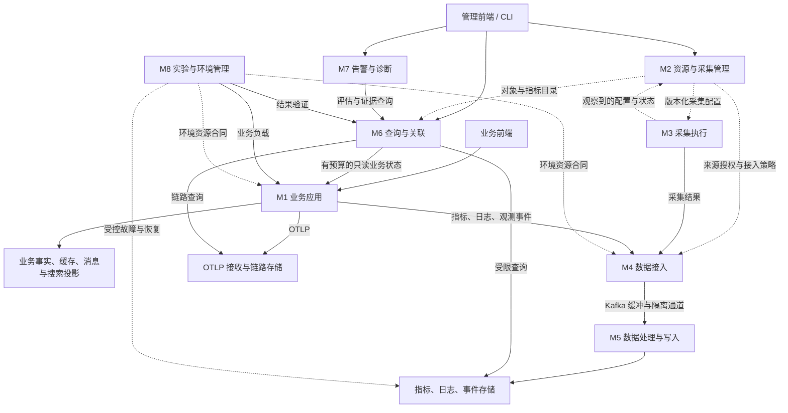
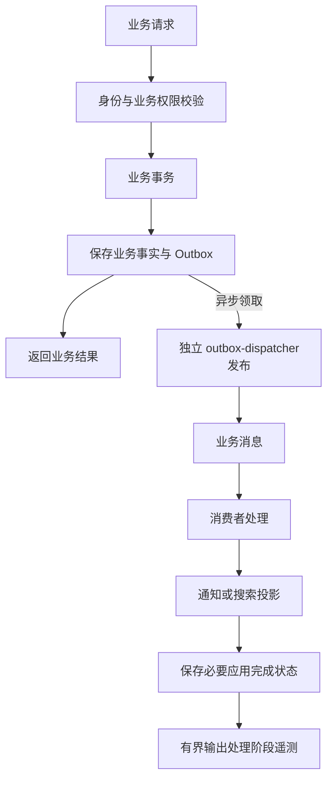
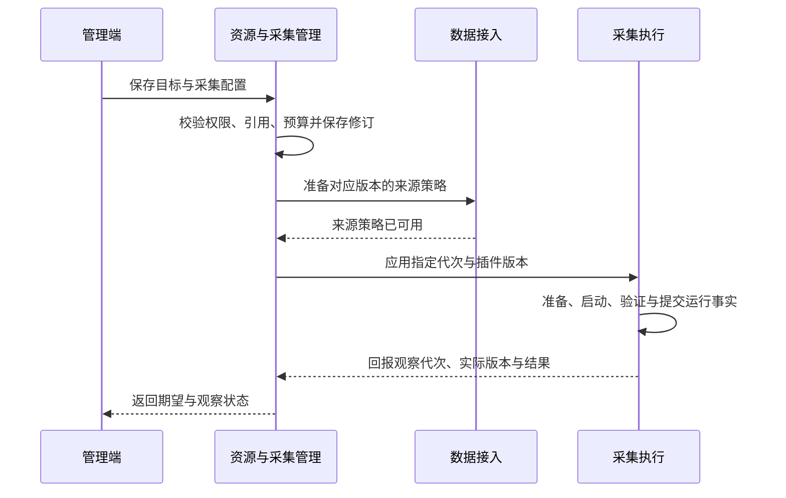
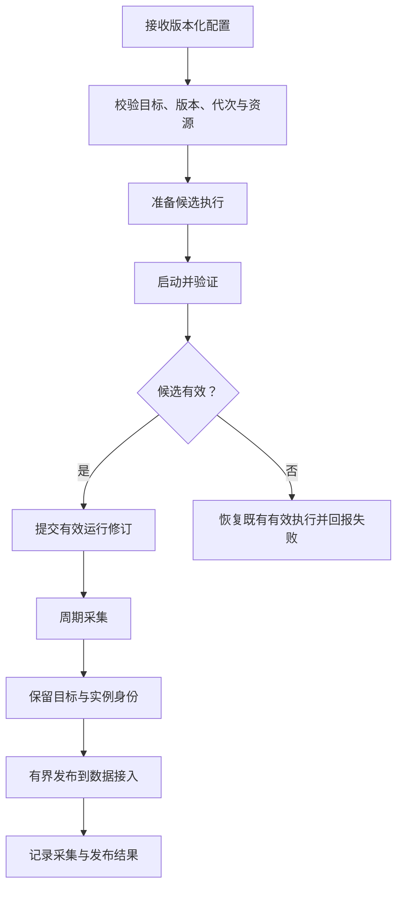
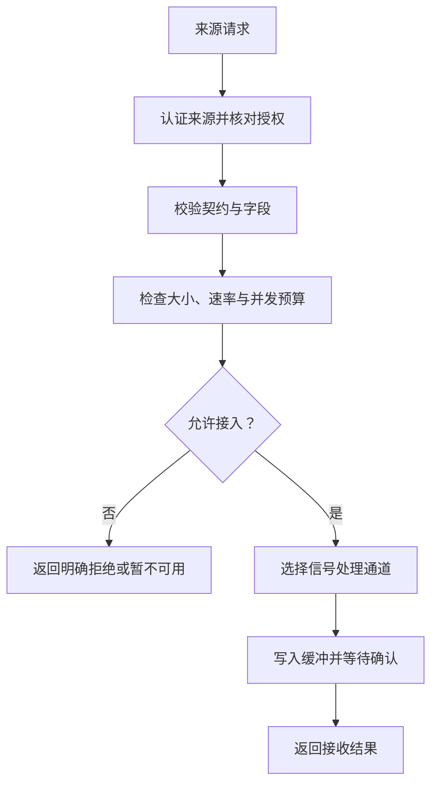
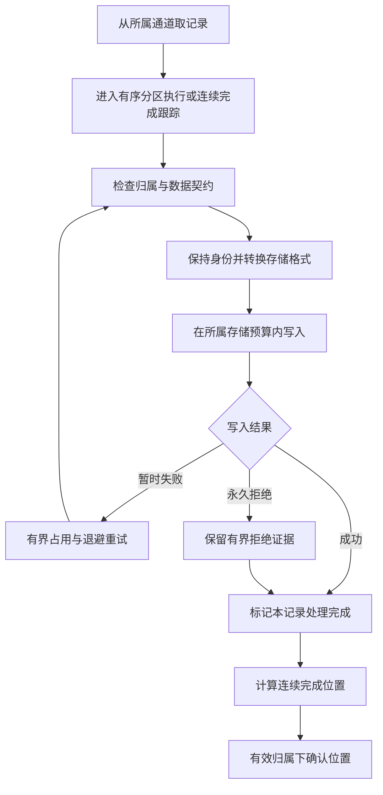
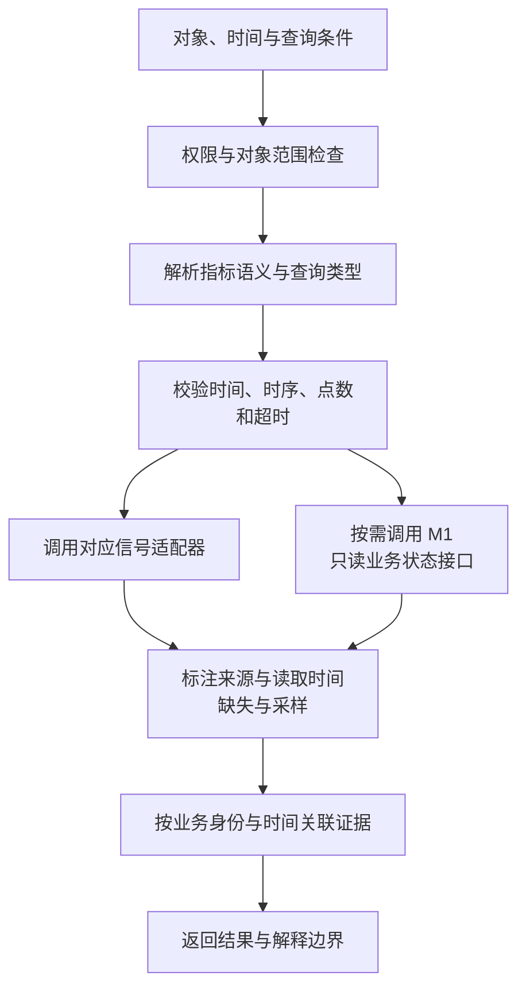
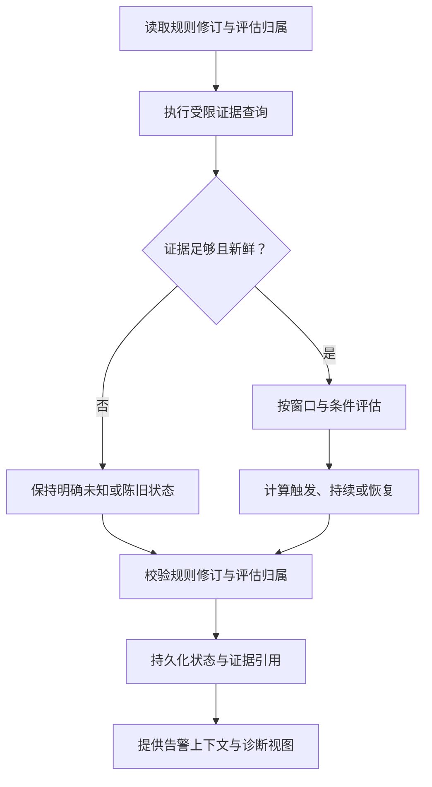
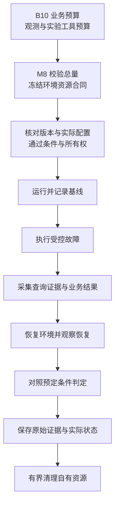
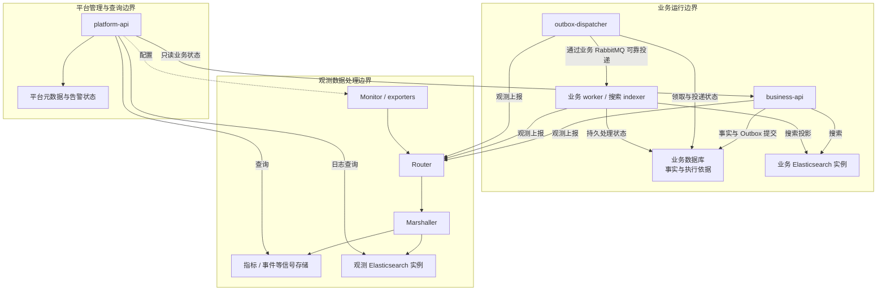

# GoPulse 可观测系统架构规划

- 编写日期：2026-10-04。
- 架构对齐修订：2026-10-05；统一两篇提案的运行边界、身份归属、环境资源和诊断契约。
- 文档性质：目标架构提案，作为现行全局发展章程的候选设计输入。
- 源码基线：`429aaeda64c60cb8293b0c61d027a9416ae07935`。
- 设计依据：GoPulse 当前源码，以及 bkmonitor-datalink、Kingeye 的本地源码对照。
- 本轮没有读取 GoPulse 原有规划文档。本文区分现有基础与目标设计，不将拟建设能力写成已完成。
- 本文不替代现行全局章程，不调整已分配的 Phase、版本、分支、实施批次或验收合同，也不直接授权产品开发。
- 覆盖范围：本文侧重可观测系统的模块架构；业务领域、并发读写、一致性和容量设计见配套的[高并发业务系统顶层架构规划](</Users/ray/GoPulse/docs/GoPulse 高并发架构设计.md>)。

## 1. 项目定位与系统组成

GoPulse 的建议定位是：**带有真实业务负载的可观测与可靠性实验平台**。

项目由三个子系统和一组公共支持能力组成：

| 子系统 | 对外提供的能力 | 对自身负责的结果 |
| --- | --- | --- |
| 业务系统 | 用户、帖子、交互、通知、搜索等业务功能 | 业务事务正确、异步副作用符合约定、重复与乱序处理有明确语义 |
| 可观测平台 | 对象管理、采集配置、数据接入、查询、告警与诊断 | 数据身份可信、查询语义明确、证据可关联、成本与故障影响有边界 |
| 实验与环境管理 | 部署环境、生成负载、执行受控故障、恢复与结果验证 | 实验条件明确、操作可追溯、结果可复现、原始证据保留 |
| 公共支持 | 身份权限、契约、基础观测与错误分类 | 共同边界一致，公共库保持有限职责 |

业务应用是长期保留的实验对象。新增业务功能应提供新的并发、状态或一致性问题；新增平台能力应改善实际对象的管理、数据解释或故障证据。主线范围以这三个子系统的完整协作为边界。

本文规划的是模块职责、接口关系、数据归属与运行边界。逻辑模块不自动对应独立进程。

两篇提案在全局章程下分别展开业务与可观测子系统。本文的 M1 对应高并发篇 B1–B10；M8 负责整体实验环境，B10 负责业务容量约束；M9 提供公共认证授权接口，账号与角色事实由 M1 内的 B2 唯一维护。共享身份字段和环境资源合同在本文第 5 节定义，业务侧的执行约束由高并发篇展开。

## 2. 整体架构与三条链路

### 2.1 顶层架构图

实线表示业务调用、数据传输或查询请求；虚线表示配置、运行状态或受控环境操作。箭头文字说明具体含义。

链路数据沿标准 OTLP 接收与存储路径运行。统一的是对象身份、授权范围、时间上下文与查询接口；不要求所有信号经过同一种消息编码或同一个 Kafka topic。M9 公共支持能力由各模块按需使用，不是图中所有调用都必须经过的中央服务。

### 2.2 业务链路

业务 API 在事务中提交事实与 Outbox；独立 dispatcher 领取并发布事件，业务消费者完成通知或搜索投影。API 返回不等待发布，dispatcher 的数量、连接、发布预算和排空独立于 API 扩容。业务数据库是业务事实来源，搜索与缓存是派生结果。

### 2.3 观测链路

业务进程与采集执行端产生信号；接入端验证来源和契约；处理端执行转换与写入；查询端读取并解释证据。观测失败不能成为普通业务事务提交或业务消息确认的必需条件。

### 2.4 控制链路

管理端记录期望配置，下发版本化变更；执行端报告已经生效的配置和运行事实。查询和接入使用已确认的元数据快照，避免每条记录都同步依赖控制 API。

配置快照必须有版本及有效性约束。控制 API 暂时不可用时，既有授权范围内的流水线按有效快照运行；不能通过关闭验证来维持可用性。

## 3. 模块总览与现有代码归位

下表中的代码位置相对仓库根目录。代码归位描述职责映射，不代表已经完成目录移动或进程拆分。

| 编号 | 模块 | 现有基础 | 目标设计的主要变化 |
| --- | --- | --- | --- |
| M1 | 业务应用 | `frontend`；`backend/internal` 的用户、帖子、交互、通知、Outbox、搜索及业务 worker | 与平台管理、查询的装配入口分开；保留真实业务一致性边界 |
| M2 | 资源与采集管理 | `backend/internal/exporterplugin`；Monitor 的插件目录与配置接口 | 建立独立目标、采集配置、插件版本、指标目录和期望状态 |
| M3 | 采集执行 | `monitor`、`exporters` | 根据采集配置运行；区分被观测实例与采集执行实例；回报配置代次 |
| M4 | 数据接入 | `router` | 从固定来源名称扩展为受控登记的来源；按契约授权、限流与分配通道 |
| M5 | 数据处理与存储 | `marshaller` 及各存储适配器；标准链路接收端 | 保留身份与信号语义；维护连续确认边界；隔离不同存储依赖 |
| M6 | 查询与关联 | `backend/internal/metricquery`、`logquery`、`eventquery` | 增加历史时间、对象筛选、指标语义、链路适配与证据关联 |
| M7 | 告警与诊断 | `backend/internal/alert`、`adminoverview` | 统一使用查询契约；组织业务阶段证据，明确未知与缺失 |
| M8 | 实验与环境管理 | `loadtest`、`lifecycle` | 管理整体环境资源合同，以固定环境和候选版本串联负载、故障、恢复与证据保存 |
| M9 | 认证与公共契约 | 认证与权限组件、日志、Tracing、`componentmetrics` 等 | 提供薄公共接口；账号与角色事实复用 M1/B2，领域状态仍由所属模块持有 |

## 4. 按模块划分的架构设计

### 4.1 M1：业务应用

**职责**

- 处理账号使用、帖子、评论、点赞、收藏及关系等业务行为。
- 在业务事务中保存权威事实与相应 Outbox 事件。
- 执行通知与搜索投影，处理重复交付、内容版本及删除语义。
- 提供稳定业务接口，向实验模块提供真实负载入口。
- 提供有预算的只读业务状态接口，供 M6 查证提交、投递和必要副作用的持久状态。
- 产生有界的指标、日志和链路信息。

**输入与输出**

输入是经身份与业务权限校验的请求，以及需要执行的业务事件。输出是业务响应、持久化事实、异步副作用和观测信号。

**数据归属与边界**

业务数据库、业务 Outbox、通知记录归 M1，内部按高并发篇 B2–B8 划分语义所有者。Redis 缓存和业务搜索索引是派生结果。账号、凭据和角色事实由 B2 唯一维护；M1 不拥有采集配置、平台告警规则或观测日志索引，观测链路不接管业务消费者的确认职责。

图中的业务返回不等待异步投影完成。消费者确认必须遵守处理、重试发布和原消息确认的具体契约。

**架构成立条件**

业务提交、异步处理和派生结果可以按同一业务身份关联；重复、乱序与删除场景有明确结果。观测存储失败不会将已经成功的普通业务事务改判失败。

### 4.2 M2：资源与采集管理

**职责**

- 维护应用、服务、实例和被观测目标的最小目录。
- 维护插件能力、不可变插件版本和采集配置。
- 维护指标定义、来源授权、合法维度及成本策略。
- 保存期望配置与变更审计，展示执行端回报的状态。
- 向采集、接入和查询提供版本化配置快照。

**最小对象模型**

| 对象 | 含义 | 必须区分的关系 |
| --- | --- | --- |
| 应用与服务 | 说明业务归属与逻辑服务 | 一个服务可以有多个运行实例 |
| 被观测目标 | 具体需要观测的资源或端点 | 目标身份不能由插件类型直接代替 |
| 运行实例 | 被观测服务的具体副本 | 同一服务的多个实例不能合并成一个 counter |
| 插件版本 | 一种采集能力的确定版本 | 同一个版本可以被多个采集配置引用 |
| 采集配置 | 目标、插件版本、参数、周期及凭证引用 | 配置拥有独立身份与修订代次 |
| 采集执行 | 实际运行某份采集配置的执行事实 | 与被观测实例、配置身份分别记录 |
| 指标定义 | 类型、单位、合法维度与聚合语义 | 逻辑指标与物理存储表达分开 |

首轮对象类型限定为项目应用、服务实例和现有中间件目标。扩展类型需要具体接入场景，不预设完整 CMDB。

**数据归属与边界**

M2 是期望配置和目录事实的写入者。执行端的运行状态以 M3 的有效回报为依据；“配置已保存”与“配置已生效”必须分别表达。明文凭证通过受限凭证机制交付，普通元数据只保存引用。

这张图规定跨模块激活约束，不强制增加分布式事务。变更应可重试；旧代次回报不能覆盖新状态；接入策略就绪后才激活新来源。

**架构成立条件**

同一插件可以管理两个独立目标。它们的配置、运行状态、数据身份和变更审计互不混淆；单个目标的更新、停用或失败有明确影响范围。

### 4.3 M3：采集执行

**职责**

- 接收并校验版本化采集配置。
- 管理插件包、执行进程、资源与凭证使用。
- 执行周期抓取、解析和采集结果发布。
- 记录实际版本、配置代次、进程归属及运行结果。
- 报告采集失败和运行变化。

**输入与输出**

输入是 M2 提供的采集配置及相应资源引用。输出是带完整对象身份的采集信号，以及可区分配置保存、应用成功和执行失败的状态。

**数据归属与边界**

M3 持有实际运行事实及提交后的有效修订。M2 可以保存其投影，但不能根据一次配置写入自行宣布进程已经运行。采集失败不生成虚假的正常值；目标不可用、解析失败和发布失败分别归类。

**架构成立条件**

有效运行版本明确、失败恢复可解释。两个服务副本经过采集、发布和存储后仍有独立时序身份；采集执行身份不会误替代被观测对象身份。

### 4.4 M4：数据接入

**职责**

- 识别来源，校验授权范围与契约版本。
- 限制消息大小、请求并发、来源速率和合法字段。
- 根据来源与信号策略分配处理通道。
- 等待所约定的缓冲接收确认，并返回明确结果。
- 记录有界的拒绝原因与入口状态。

**输入与输出**

输入是采集结果、进程日志和受控观测事件。输出是进入指定通道的合法记录，或者明确的拒绝/暂不可用结果。链路接入使用标准 OTLP 接收端，遵守对应授权与资源策略。

**数据归属与边界**

M4 不保存业务事实、不执行告警、不承担最终存储查询。入口确认只证明约定的接收阶段已完成，不能表示最终落库或查询可见。

**架构成立条件**

来源合法性由受控登记与契约确定，新增同类目标不依赖复制一套来源名称判断。一个来源超出预算时有确定处理结果，其他来源保有约定资源。

### 4.5 M5：数据处理与存储

**职责**

- 保留对象身份，执行信号解析、规范化与存储转换。
- 管理批量写入、并发、幂等键、退避及错误分类。
- 维护分区所有权和连续处理完成的确认边界。
- 为不同存储依赖配置独立处理预算与故障隔离单元。
- 管理物理索引、存储契约、保留期限和有界清理。

**信号与存储关系**

| 信号 | 保存内容 | 处理约束 |
| --- | --- | --- |
| 指标 | 样本、时间、受限标签与对象身份 | 保持 counter、gauge、histogram 语义，控制时序基数 |
| 日志 | 结构化记录、来源及关联字段 | 明确远程副本丢弃语义；重试采用稳定记录身份 |
| 观测事件 | 配置变化、运行变化及故障事件 | 与业务驱动事件区分；保留事件身份、严重程度和时间 |
| 链路 | 标准 Span 与资源上下文 | 使用标准接收/存储路径；声明采样与证据完整性 |

**数据归属与边界**

M5 对信号落库和物理存储契约负责。M6 通过适配器查询这些数据；M1 的业务搜索索引仍由业务模块管理。指标、日志、事件和链路的交付保证分别定义，不统一承诺“所有数据绝不丢失”。

“永久拒绝”必须由明确的数据契约定义；普通存储不可用不能被分类成永久拒绝。后续记录的成功不能越过未完成记录推进确认位置。链路接收端使用自身协议的确认语义，不套用 Kafka 分区流程。

**架构成立条件**

记录身份经过写入仍可用于查询；重试不会改变事件身份。一个存储故障的处理范围可界定，其他信号在约定资源内继续运行。落库完成与查询可见分别表达。

### 4.6 M6：查询与关联

**职责**

- 建立公共查询上下文：授权对象、实例、起止时间、维度及成本预算。
- 按指标目录解释单位、类型、聚合与派生表达。
- 分别适配指标、日志、事件和链路后端。
- 为展示、告警、诊断和实验提供一致的查询服务。
- 返回新鲜度、采样、缺失、来源错误及部分结果信息。
- 根据业务身份与时间组织关联证据。
- 通过 M1 的只读状态接口查证业务阶段，将持久状态与遥测分别标注。

**输入与输出**

输入是受限的查询请求、M2 的目录快照，以及诊断时 M1 返回的业务状态。输出是带明确语义及质量状态的结果。告警接口可以取得原始样本，避免用展示曲线的插值结果证明新鲜度。

**数据归属与边界**

M6 不修改业务事实、采集运行状态或原始证据。关联查询不承诺自动证明根因，不执行无界跨存储扫描。关联 ID 按适用信号存储，不能全部转成指标标签。

只读业务状态按 `data_epoch` 与命令、事件或对象身份查询，限制对象数、时间范围、数据库占用和期限。M1 返回提交结果、Outbox 投递状态、适用消费者/投影目标的持久完成记录及记录时间；必要时由 B7 提供指定索引代际下的受限可见性检查。M6 不直接扫描业务表，也不要求业务写入等待这类查询。

各存储的状态分别带读取时间与适用版本，不伪装成跨数据库、消息系统和搜索的原子快照。记录已清理、超出保留窗口、权限不足或后端不可用时返回明确缺口；遥测缺失和找不到完成记录都不能单独证明阶段未发生。

**架构成立条件**

能够指定历史窗口和具体实例；速率、错误比例和延迟分位数有可解释口径。局部值与共享值采用正确聚合方式；没有数据、真实零和查询错误不会被合并。

### 4.7 M7：告警与诊断

**职责**

- 保存策略定义及修订，执行有预算的周期评估。
- 管理触发、持续、恢复、未知和陈旧状态。
- 保存告警状态及必要的评估证据。
- 组织请求和异步业务处理阶段，展示已知事实与缺口。
- 向管理界面提供告警与诊断上下文。

**输入与输出**

输入是策略、M6 查询结果和有效的评估归属。输出是持久化告警状态、状态变化以及可回查的证据引用。

**数据归属与边界**

M7 是规则和告警状态的写入者。原始信号属于 M5；查询解释属于 M6；业务事实属于 M1。查询失败不能宣布业务恢复，Span 缺失也不能直接宣布对应业务阶段未发生。

诊断视图按同一数据代际、事件及适用对象版本组织阶段：持久提交结果证明“已提交”，Outbox 待投递状态说明“发布尚未被持久确认”，消费者失败记录说明对应尝试失败，应用完成记录证明约定副作用已完成。发布确认与状态更新之间的崩溃可能产生重投，不能把“尚未确认”写成“Broker 从未收到”。

“搜索写入已完成”和“当前查询可见”分别查证：后者要说明索引代际、查询时间及业务事实过滤结果。没有完成记录时搜索可能已经写入，旧版本的完成也不证明新版本可见。M7 展示 M6 返回的事实、遥测和缺口；覆盖不足时保留“未知”，每项判断都能回查来源。

**架构成立条件**

告警评估与展示采用一致的指标和数据质量解释；状态变更不会被旧规则或旧归属覆盖。诊断结果区分事实、推断和未知。

### 4.8 M8：实验与环境管理

**职责**

- 维护整体环境资源合同，绑定代码/候选版本、制品、配置、资源和实验条件。
- 汇总 B10 的业务预算及可观测模块预算，检查共享依赖总量后冻结实验配置。
- 经正式业务接口生成负载，执行受控环境操作。
- 在自有资源范围内制造故障、恢复并清理。
- 经 M6 查询运行证据，同时校验业务结果。
- 保存原始数据、操作记录、执行预算及结果判定。

**输入与输出**

输入是有明确资源、负载、持续时间、通过条件和停止规则的实验定义。输出是实际运行结果、证据及完整/失败/暂停状态。

**数据归属与边界**

M8 持有环境资源合同、实验定义、执行事实和证据文件。B10 提供并执行业务准入、连接、消费、重建及维护预算；M2–M7 提供并执行各自的观测预算。M8 同时申报负载生成及环境工具预算，汇总、校验和冻结这些声明，经各模块的配置入口应用，不另建一套业务限流或调度控制器。正常业务运行不逐请求依赖 M8。

M8 不通过修改业务表或回执制造成功，也不绕过查询契约解释观测结果。环境操作只针对明确拥有的资源，清理也按相同范围执行；数据重置或恢复时按第 5.1 节同步建立新的数据代际。

流程中的任一阶段都可能失败或被用户停止。此时保留实际证据，执行适用的有界恢复/清理，不将后续计划步骤记成已完成。不可缩短必要测量窗口来声明长时间运行成立。

**架构成立条件**

同一组实验条件可重复执行；负载、故障、恢复、业务正确性和观测结果可以对应到同一候选版本。观测缺失本身也进入结果解释。

### 4.9 M9：认证与公共契约

**职责**

- 提供身份识别、权限判定、角色读取与凭证引用的公共接口。
- 定义共同消息身份、契约版本、错误分类和时间表示。
- 提供日志、Tracing、组件指标及有界发送的基础能力。
- 提供审计写入接口，由领域模块记录对应变更事实。

**数据归属与边界**

M9 不持有第二套账号、凭据或角色事实。M1 内的 B2 是这些事实以及业务资料、关注关系的唯一语义所有者；业务与平台通过同一套 B2 领域接口读取身份，角色变更也进入 B2 的唯一命令入口。M9 适配身份校验与各领域的授权规则，不能自行写账号表或角色表。

默认复用现有账号体系。B2 接口可在业务和平台进程中按相同契约装配，不因此强制增加独立身份服务或每次认证的跨进程 RPC。它访问的数据库计入共享连接预算；角色事实不可取得时管理操作拒绝执行。复用代码和分开 API 进程不能证明认证故障域已分离。共享库不保存其他模块的领域状态，也不绕过所有者操作数据库或运行进程。

**架构成立条件**

模块之间使用相同身份与契约含义；权限校验同时存在于接口和执行边界。公共库保持有限职责，业务模块与平台模块可以分别装配和运行。

## 5. 跨模块共同契约

### 5.1 身份与对象契约

目标、运行实例、采集配置、采集执行、插件版本分别拥有适用身份。不同信号不必携带所有字段，但必须能解析被观测对象、来源和必要的关联信息。

身份解析、字段合法性及引用关系由共同契约定义。M3 不自行压缩实例身份，M4 不按来源名字推导目标，M5 不丢掉后续查询需要的身份，M6 不以固定目标替代用户选择。

业务和观测使用以下关联字段，各字段的作用分别定义：

| 字段 | 含义与作用范围 | 使用约束 |
| --- | --- | --- |
| `data_epoch` | 一份业务数据环境的代际；重置或恢复后建立新的值 | 进入业务事件、缓存/索引命名及适用的诊断上下文；阻止旧代际覆盖新事实，不作为对象版本排序值 |
| `experiment_id` | 一次实验执行的身份 | 由 M8 记录并传播到适用的请求和证据；同一数据代际可有多次实验，不用它决定业务幂等或数据版本 |
| `command_id` | 一次业务命令的身份 | 由业务模块生成或校验，与幂等键的映射持久保存；同一命令重试保持不变，下一次相反操作使用新命令 |
| `event_id` | 一次事实转换事件的身份 | 重投和同代际重放保持不变；不要以投递尝试或日志记录 ID 替代 |
| `object_id`、`object_version` | 业务对象及其适用修订或状态转换 | 与数据代际共同解释；内容版本、互动转换和统计新鲜度分别定义，不为所有互动递增帖子版本 |
| `consumer_id`、`projection_generation` | 副作用处理者，以及适用时的索引等投影代际 | 应用完成与路由契约关联；新投影代际不能借用旧代际完成记录证明已完成 |
| `trace_id`、`request_id` | 请求或链路证据关联 | 适用于日志、Span 和诊断；采样或缺失不改变持久业务状态 |

数据代际记录在持久环境配置中。M8 协调重置/恢复，业务恢复入口及消费者核对实际代际后才能恢复准入与重放；不能只改观测标签。运行时用有效配置校验，不同步询问实验控制端。索引重建只改变投影代际，不自动改变业务数据代际；历史查询明确选择代际，不能混合新旧环境结果。

信号按来源携带适用字段：业务日志、Span 和阶段事件保留业务关联身份；中间件指标保留目标与实例身份；实验归档绑定环境代际和实验 ID。逐请求、命令、事件、对象、实验及 Trace ID 不进入普通指标标签，保持时序基数有界。

### 5.2 时间与统计契约

- 区分事件发生时间、采集时间和处理时间。
- 对跨进程耗时声明时钟与误差假设。
- 区分 counter、gauge 与 histogram 的派生和聚合方式。
- 区分实例局部指标与对共享事实的重复观测。
- 明确原始样本、展示采样与插值结果的用途。
- 全量统计与链路采样分别设计；不能从客户端未发送的 Span 恢复全量证据。

### 5.3 接收、落库与可见性契约

三个阶段分别表达：

| 阶段 | 能证明的事实 | 不能替代的事实 |
| --- | --- | --- |
| 已接收 | 入口约定的验证与缓冲确认完成 | 最终存储已成功 |
| 已落库 | 对应存储写入契约完成 | 所有查询接口立即可见 |
| 可查询 | 指定查询契约下已能取得结果 | 业务异步副作用必然全部完成 |

各阶段以现有日志、指标或事件提供适当证据，不要求为每条高频观测记录建立一行全局状态表。

### 5.4 资源与故障隔离契约

M8 维护版本化环境资源合同，记录候选与配置修订、数据代际、工作负载、测量窗口、实例数及发布重叠、CPU/内存/磁盘、依赖实例、连接/在途/写入预算和恢复预留。B10 提交业务预算及容量目标；M2–M7 提交控制、采集、接入、写入、查询和评估预算。预算按实际共享的宿主机和依赖汇总，预留项只计一次。

合同职责按以下边界划分：

| 事项 | 定义与持有者 | 执行者 |
| --- | --- | --- |
| 环境资源合同、实验参数、冻结版本、运行记录与原始结果 | M8 | M8 校验总量、组织实验并归档 |
| 业务容量目标和准入、连接、消费、维护预算 | B10 | B1–B9 与各业务运行进程 |
| 控制、采集、接入、写入、查询和评估预算 | M2–M7 | 各自运行单元 |

M8 保存配置来源和实际生效修订；声明与实际部署不一致时不能给出该合同下的容量结论。合同变更经所属模块验证并发布，不能直接覆盖在线业务限制。运行时继续执行有效预算，不把 M8 作为请求或信号处理的同步依赖。

隔离单元依据来源、信号、存储依赖和处理顺序确定。独立进程、独立通道及独立实例必须说明具体隔离目标；它们各自不能自动证明完整故障隔离。

## 6. 数据归属与部署架构

### 6.1 数据归属

| 数据 | 写入负责人 | 主要载体 | 其他模块的访问方式 |
| --- | --- | --- | --- |
| 账号、凭据、角色与业务关系 | M1/B2 | 业务数据库 | B2 的身份与命令接口，经 M9 适配 |
| 业务事实、Outbox、通知与业务处理状态 | M1 内对应 B 模块 | 业务数据库与业务消息系统 | 业务接口、有预算的只读状态接口或注明质量的观测投影 |
| 对象、采集配置、指标目录与来源策略 | M2 | 平台元数据库及版本化快照 | 管理接口与受控快照 |
| 有效采集修订、进程归属与实际状态 | M3 | 执行端持久化状态及回报 | 控制接口读取状态投影 |
| 原始指标、日志、观测事件与 Span | M5 / 标准链路接收端 | 各信号后端 | M6 的查询适配器 |
| 策略、评估归属与告警状态 | M7 | 平台告警存储 | 告警接口与上下文查询 |
| 环境资源合同、实验条件、操作、原始结果和回执 | M8 | 环境配置与实验归档 | 版本化合同、结果读取与证据引用 |

业务缓存与业务搜索投影由 M1 负责；观测索引与保留策略由 M5 负责。不同模块不得通过跨表或跨索引写入绕过所有者。

### 6.2 建议运行单元

| 运行单元 | 包含的逻辑模块 | 独立运行的依据 |
| --- | --- | --- |
| `business-api` | M1 的请求服务、业务事实与 Outbox 事务提交；适用 M9 能力 | 请求容量与平台查询、异步投递分别分配 |
| `outbox-dispatcher` | M1/B6 的领取、可靠发布与投递状态更新 | 数量、连接、发布预算与排空独立于 API 扩容 |
| 业务 worker / 搜索 indexer | M1 的异步消费者 | 与请求服务分开控制消费、重试和投影 |
| `platform-api` | M2、M6、M7 的管理与使用接口；适用 M9 能力 | 管理与证据查询独立于业务请求压力 |
| Monitor 与 exporter 执行进程 | M3 | 承担插件与采集进程管理 |
| Router | M4 | 承担入口授权与来源预算 |
| Marshaller | M5 的指标、日志与事件处理 | 承担缓冲消费、写入与确认 |
| OTLP 接收与链路后端 | M5 的标准链路路径 | 保留标准协议与采样语义 |
| CLI 与实验工具 | M8 | 环境控制、实验预算和原始证据独立管理 |

控制、查询和告警首先以清晰逻辑模块存在于平台入口；告警评估有独立执行预算。是否进一步拆进程，由具体资源或故障要求决定。

该图着重显示运行单元与后端隔离，RabbitMQ 以投递通道表示；缓存及完整业务依赖见高并发篇部署图，标准 OTLP 路径见本文顶层图。

默认业务 Elasticsearch 与观测 Elasticsearch 使用独立实例，各自配置连接、写入、查询和保留预算。若受资源约束选择共用实例，必须在环境合同中明确为降级部署，并放弃两者后端故障隔离的结论。

业务与平台元数据数据库可以在逻辑归属明确的前提下共用物理实例。业务进程、平台身份读取、平台元数据、诊断、发布重叠和维护均计入该实例总连接与存储预算，不能只加总业务连接；不同 schema 或连接池不能证明后端故障隔离。需要验证数据库后端隔离时部署为不同实例，共享宿主机、网络或磁盘带来的共同故障域仍须记录。

## 7. 模块协作与系统验收

本节是目标架构成立的系统条件，不是新增 Phase 分配或可直接执行的实施矩阵。具体命令、实验时长、预算及完成门禁由对应实施合同确定。

| 系统场景 | 协作模块 | 必须证明的结果 |
| --- | --- | --- |
| 同一插件管理两个独立目标 | M2、M3、M4、M5、M6 | 配置与状态独立，数据身份不混淆，查询能分别选择 |
| 两个服务副本产生已知 counter 增量 | M1、M3、M5、M6、M7 | 单实例及聚合结果正确，重启/重置与缺失处理可解释 |
| 较早消息未完成时较晚消息成功 | M4、M5、M8 | 不越过未完成记录推进确认，重启后的处理结果符合交付契约 |
| 帖子提交后搜索迟迟不可见 | M1/B6/B7、M6、M7 | 同代际、事件和业务版本的持久状态与查询可见性分别查证，缺遥测不误判为未执行 |
| 一个来源过载或一个观测后端不可用 | M3、M4、M5、M6、M8 | 影响范围与预算明确，其他通道保有约定进展，数据缺口可见 |
| 控制端暂时不可用 | M2、M3、M4、M5 | 有效快照范围内的既有流水线遵守契约，新变更不被误报生效 |
| 业务故障实验与平台查询同时进行 | M1、M6、M8、M9 | 实验条件、身份依赖和共享故障域明确，证据与业务结果可对应 |
| 实验失败或中途停止 | M8 及被操作模块 | 保留实际进展与原始证据，有界恢复/清理，不宣告未验证结果 |
| 数据重置或恢复后旧事件到达 | M1/B6/B9、M5、M6、M8 | 旧代际不能覆盖新事实，诊断与实验结果不混合新旧数据 |
| API 扩容与平台诊断同时运行 | M1/B10、M6、M8 | dispatcher 数量独立，所有共享依赖预算合计仍在环境合同范围内 |

模块依赖应支持上述场景：M2 提供对象与契约，M3/M4/M5 保存数据含义，M6 提供统一查询解释，M7 消费这些解释，M8 验证整个系统。M1 的业务事实与处理保证独立成立。

## 8. 规划范围与建议终点

本提案的主线范围包括：

- 现有业务应用的正确性、并发与异步处理。
- 受控对象登记、多个同类目标及服务副本的观测。
- 指标、日志、事件、链路的适用接入与查询。
- 有证据边界的告警和业务阶段诊断。
- 有预算的负载、故障、恢复及结果复现。

完整 CMDB、多租户平台、任意协议接入、通用动态 DAG、平台级分布式调度、独立存储引擎和自动根因判定不作为本提案的默认建设范围。新增这些能力应有现有模块无法满足的具体场景及成本依据。

建议终点是：三个子系统能够共同证明多目标身份、业务一致性、观测查询、故障隔离与实验复现，并形成可供他人理解和重跑的案例。达到该条件后，以维护和案例完善为主。终点及任何全局范围调整，仍需纳入现行全局章程，不能仅凭本提案改变已分配合同。

## 9. 源码依据与判断限制

### 9.1 GoPulse 的现有基础

- [业务与平台功能当前在同一入口装配](/Users/ray/GoPulse/backend/cmd/server/main.go)。
- [固定官方插件目录](/Users/ray/GoPulse/monitor/internal/plugin/catalog.go)、[现有插件运行控制](/Users/ray/GoPulse/monitor/internal/plugin/runtime.go)。
- [组件副本采集](/Users/ray/GoPulse/monitor/internal/metrics/collector/components.go)、[组件指标消息身份](/Users/ray/GoPulse/monitor/internal/metrics/envelope/envelope.go)。
- [Kafka 消费调度](/Users/ray/GoPulse/marshaller/internal/consumer/kafka.go)、[处理与确认边界](/Users/ray/GoPulse/marshaller/internal/consumer/processor.go)。
- [公开指标查询契约](/Users/ray/GoPulse/backend/internal/metricquery/metricquery.go)、[告警原始样本查询](/Users/ray/GoPulse/backend/internal/metricquery/alert_points.go)。
- [Outbox 发布](/Users/ray/GoPulse/backend/internal/outbox/dispatcher.go)、[业务消费](/Users/ray/GoPulse/backend/internal/worker/handler.go)、[搜索投影](/Users/ray/GoPulse/backend/internal/search/processor.go)。
- [现有日志与链路基础](/Users/ray/GoPulse/backend/internal/observability)、[环境工具](/Users/ray/GoPulse/lifecycle)、[负载工具](/Users/ray/GoPulse/loadtest)。

### 9.2 参考项目带来的设计输入

| 参考机制 | 对 GoPulse 的设计输入 | 借鉴边界 |
| --- | --- | --- |
| Kingeye 采集配置区分插件、目标和配置身份 | M2/M3 区分期望配置、被观测目标与实际执行 | 不据此引入完整对象中心与调度体系 |
| Kingeye 指标目录与 APM 查询上下文 | M2/M6 统一指标语义、对象范围和历史时间 | 保留受限查询，不开放无界表达式 |
| Kingeye 请求与日志主题关联 | M6/M7 组织同一业务上下文中的证据 | 不将关联结果自动声明为根因 |
| 蓝鲸 Collector 区分信号、协议、来源与内容 | M4/M5 明确接入契约及处理职责 | 不复制全部协议和处理插件 |
| 蓝鲸按来源控制流量与时序基数 | M4/M5 将成本边界落实在入口和处理单元 | 不照搬生产规模的配置数值 |
| 蓝鲸采样、派生与 exemplar 机制 | M5/M6 分别说明统计口径、采样和关联证据 | 不把 trace ID 用作普通高基数时序标签 |

本地参考工作区为 `/Users/ray/bkmonitor-datalink` 与 `/Users/ray/kingeye`。Kingeye v5 中正在演进的机制作为设计输入，不因代码存在就视为已经过长期生产验证。

本文基于静态源码研究，没有通过运行实验证明性能、故障发生概率或全部交付保证。所有架构成立条件均是目标要求，不是本轮测试结果。

2026-10-05 对齐修订验证：10 个 Mermaid 图通过解析与实际渲染，变更的总图、业务流程、查询、实验及部署图完成视觉检查；16 处本地引用均有效。此次仅修改架构文档，没有执行应用验证、压测或故障实验。
