# GoPulse 高并发业务系统顶层架构规划

- 编写日期：2026-10-04。
- 架构对齐修订：2026-10-05；统一两篇提案的运行边界、身份归属、环境资源和诊断契约。
- 文档性质：目标架构提案，是现行全局发展章程的候选设计输入。
- 源码基线：`8b01178f3d490ef2e51355218ea3678bece91c98`；本次只检查业务源码、测试中的公开行为和可执行配置。
- 研究范围：GoPulse 当前业务链路，以及 Mastodon、Vitess、RabbitMQ、MySQL、Elasticsearch 和 k6 的官方设计文档。
- 本次未读取 GoPulse 原有规划文档，未执行应用压测。文中的目标设计、容量公式和实验条件不代表现有能力或性能结果。
- 本文不替代全局章程，不调整已分配的 Phase、版本、分支、实施批次和验收合同，不直接授权产品实施。
- 配套文档：[可观测系统模块架构提案](</Users/ray/GoPulse/docs/GoPulse 可观测架构设计.md>)。本文展开业务系统，配套文档展开采集、信号处理、查询和诊断。

## 1. 顶层结论与系统边界

GoPulse 的高并发部分应围绕已有的社区业务展开：用户、帖子、评论、点赞、收藏、关注、搜索和通知。目标是让这些业务在均匀流量、热门内容、依赖故障和后台积压下，仍有明确的正确性、资源上限和恢复方式。

推荐形态是：**模块化业务服务 + 可独立扩容的异步进程 + 有界的读模型 + 单一业务事实库**。逻辑上划分十个模块，部署上按前台请求、事件投递、投影消费、后台维护和平台管理分配资源。模块数量不等于微服务数量。

本文 B1–B10 对应可观测篇的 M1 业务应用。B2 唯一维护账号、凭据与角色事实，M9 提供公共认证授权接口；B10 提供并执行业务容量约束，M8 维护整体环境资源合同并组织实验。共同身份字段和环境资源合同采用可观测篇第 5 节的定义，具体业务完成与恢复语义由本文展开。两篇均为现行全局章程下的子系统设计输入。

高并发架构必须同时回答四个问题：

1. 用户收到成功时，哪些业务事实已经持久化？
2. 某条热门内容能否让无关请求一起等待？
3. 缓存、搜索、消息系统变慢时，剩余资源允许接收多少工作？
4. 积压能否在继续接收正常流量的同时排空，且不丢失事实、不复活删除内容？

本设计不预设“百万 QPS”、分库分表、推荐系统、多地域多活或新的业务品类。它们需要相应的业务需求和容量证据。当前业务已经足够暴露读放大、热点锁、异步一致性和故障恢复这些实际问题。

### 1.1 三种负载不能混为一谈

| 负载 | 主要资源 | 架构关注点 |
| --- | --- | --- |
| 大量短 HTTP 请求 | CPU、内存、数据库连接、依赖耗时 | 准入、请求期限、批量读、连接预算 |
| 大量并发业务写入 | 行锁、唯一约束、日志写入、事务持有时间 | 缩小串行边界、事务与事件原子提交 |
| 大量异步工作 | 消费并发、消息在途量、投影吞吐、磁盘积压 | 分队列隔离、幂等、背压、排空能力 |

已有业务主要属于这三种负载。长连接推送若以后成为产品要求，应拥有独立连接生命周期和预算；本文不把它提前加入默认部署。

## 2. 当前源码提供的依据

下面列的是已看到的结构和设计后果，不是已经测出的性能瓶颈。

| 当前结构 | 源码依据 | 对顶层设计的影响 |
| --- | --- | --- |
| API 已有总并发准入，饱和返回 503，探针不占 API 名额 | [router.go](/Users/ray/GoPulse/backend/internal/http/router.go:118) | 保留这一基础，进一步按请求成本隔离 |
| 两个 Backend、两组业务消费进程已有部署定义 | [compose.yaml](/Users/ray/GoPulse/deploy/compose.yaml:407) | 不重新发明水平部署，补足共享依赖的全局预算 |
| 帖子、评论、点赞、关注已有事务与 Outbox 基础 | [post/repository.go](/Users/ray/GoPulse/backend/internal/post/repository.go:115)、[comment/repository.go](/Users/ray/GoPulse/backend/internal/comment/repository.go:73) | 保留事实和事件同事务提交 |
| 点赞、评论、收藏都对父帖子取排他锁 | [like/repository.go](/Users/ray/GoPulse/backend/internal/like/repository.go:79)、[bookmark/repository.go](/Users/ray/GoPulse/backend/internal/bookmark/repository.go:48) | 独立交互被聚集到同一串行点，需要重新定义锁范围 |
| 详情缓存命中仍检查 MySQL 内容版本，再补作者与个人关系 | [post/service.go](/Users/ray/GoPulse/backend/internal/post/service.go:129) | 缓存不是零数据库访问路径，容量模型必须计入事实校验和个人状态 |
| 点赞、评论会删除包含正文和计数的整个详情缓存 | [post/cache.go](/Users/ray/GoPulse/backend/internal/post/cache.go:19)、[like/service.go](/Users/ray/GoPulse/backend/internal/like/service.go:44) | 热门互动会使正文缓存反复失效，正文与统计需分开 |
| 列表查询含逐帖计数子查询，关注流在读时筛选关注关系 | [post/repository.go](/Users/ray/GoPulse/backend/internal/post/repository.go:89) | 有游标不等于查询成本恒定，列表需要扫描预算 |
| 搜索消费在持有帖子行锁期间执行 ES 写入 | [search/processor.go](/Users/ray/GoPulse/backend/internal/search/processor.go:101) | 外部依赖耗时进入业务锁和连接占用，需先替换正确性机制才能移除 |
| 删除等待搜索重建全局锁，并在事务里清理多张关联表 | [post/delete.go](/Users/ray/GoPulse/backend/internal/post/delete.go:49) | 删除与数据规模、维护任务耦合，需要分开业务删除与物理回收 |
| 通知通过 source_event_id 唯一约束抵抗重复消息 | [notification/repository.go](/Users/ray/GoPulse/backend/internal/notification/repository.go:13) | 保留已经有效的消费幂等边界 |
| 搜索已有版本写入、PIT 游标和回源过滤 | [search/processor.go](/Users/ray/GoPulse/backend/internal/search/processor.go:199)、[search/service.go](/Users/ray/GoPulse/backend/internal/search/service.go:169) | 继续让搜索做候选检索，让事实库决定可见性 |
| 压测器已有按时间到达的调度和未发出槽位记录 | [load/runner.go](/Users/ray/GoPulse/loadtest/internal/load/runner.go:840) | 可复用既有发生器，不能把工具侧丢弃隐藏在业务成功率之外 |

### 2.1 开源项目给出的启发

| 参考 | 可借鉴的事实 | 本文的设计判断 |
| --- | --- | --- |
| [Mastodon 扩容文档](https://docs.joinmastodon.org/admin/scaling/) | 前台、后台和流式连接分别配置并发；后台队列按工作类型隔离；各进程共同消耗数据库连接；缓存可独立配置 | 按运行时资源需求部署，统一计算连接总量。GoPulse 保留自己的 MySQL、RabbitMQ 技术栈 |
| [Vitess 架构](https://vitess.io/docs/24.0/overview/architecture/)与[连接池诊断](https://vitess.io/docs/24.0/user-guides/configuration-basic/troubleshooting/) | 池等待可能来自长事务；盲目加大连接池可能把争用转移到 MySQL；单库优化与后续分片有不同成本 | 先建立数据库预算与查询成本模型；Vitess 是条件性参考，不是默认引入项 |
| [RabbitMQ 确认协议](https://www.rabbitmq.com/docs/confirms) | 发布确认与消费确认是两个不同边界，消费端必须处理重投 | 将事实提交、消息持久化和投影完成分别建模 |
| [Google SRE 级联故障分析](https://sre.google/sre-book/addressing-cascading-failures/) | 工作积压和重试会放大过载 | 所有入口、等待、在途消息和恢复操作都设置资源上限 |

“可借鉴的事实”来自上述文档；“本文的设计判断”是结合本项目作出的推论。没有采用其他项目的用户规模或性能数字作为 GoPulse 的容量承诺。

## 3. 模块总图与运行时布局

### 3.1 逻辑架构

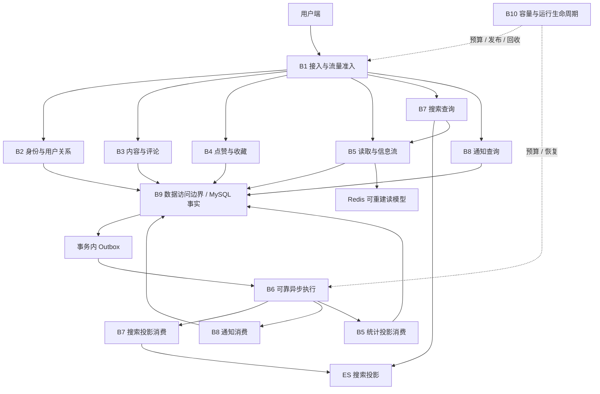

图中的 Outbox 是业务事务写入的记录，箭头不表示数据库自行发布消息。B6 在事务提交后领取记录并投递。B9 提供数据访问与资源约束，业务数据的语义所有权仍归相应领域模块。

### 3.2 模块责任表

| 模块 | 负责的能力与数据 | 主要接口 | 主要并发边界 |
| --- | --- | --- | --- |
| B1 接入与准入 | 请求路由、成本分类、限额、期限 | HTTP、请求上下文 | 全局预算、实例名额、身份限额 |
| B2 身份与关系 | 用户、凭据、角色、关注事实 | 身份校验、资料、关系命令与批量读 | 密码计算、关系唯一键、权限事实 |
| B3 内容与评论 | 帖子、评论、内容版本、删除状态 | 内容命令、可见性查询、内容事件 | 同一内容的编辑与删除 |
| B4 点赞与收藏 | 用户与内容之间的交互事实 | 设置目标状态、个人状态批量读 | 同一用户与目标的状态转换 |
| B5 读取与信息流 | 页面装配、正文缓存、统计投影、关注流 | 详情、列表、候选装配 | 每页工作量、缓存重建、读放大 |
| B6 可靠异步执行 | Outbox 投递、任务分流、重试、重放 | 发布、消费、失败处置 | 领取租约、消费并发、在途量 |
| B7 搜索 | 查询、索引版本、删除投影、索引代际 | 候选检索、版本化投影、重建 | 外部 I/O、同一内容版本 |
| B8 通知 | 通知记录、已读事实、去重 | 通知消费、列表、标记已读 | 接收人读取、事件唯一性 |
| B9 数据访问与持久化 | 数据库资源、索引契约、缓存/投影分类、恢复 | 有预算的数据访问、备份恢复 | 总连接、事务时间、存储增长 |
| B10 容量与生命周期 | 容量契约、发布、排空、维护、实验接口 | 配置、部署、维护任务、容量证据 | 整体资源分配与恢复余量 |

### 3.3 部署架构

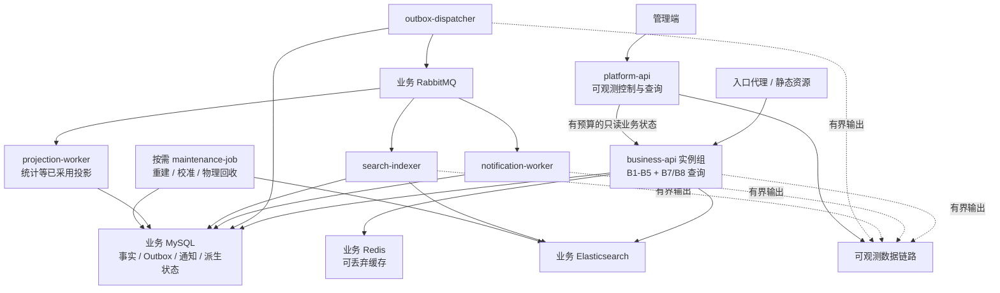

部署规则：

- 同一代码仓库、相同领域契约，可以构建不同运行模式；前台业务模块默认同进程，不增加领域间 RPC。
- API 只在业务事务中提交事实与 Outbox，不装配后台发布循环。事件投递不与每次 API 扩容绑定，独立 dispatcher 拥有自己的数量、连接、发布预算和排空流程。
- 通知与搜索已有独立进程基础；统计消费仅在正式采用统计投影时加入，不提前部署一个空 worker。
- 维护任务按需运行并受限速控制，不常驻一个没有业务必要的调度平台。
- platform-api 与业务 API 分离进程和准入预算，通过 M9 复用 B2 的身份接口。共享数据库时，平台身份读取、元数据、诊断及维护均计入该物理实例总预算。
- Compose 中已有业务 ES 与可观测 ES 分离，目标默认继续使用独立实例与各自预算。共用 ES 仅作为环境合同明确记录的降级部署，不能给出两者后端故障隔离结论；共享机器的 CPU、内存和磁盘竞争仍需计入。
- 图表示进程职责，不承诺数据库、消息系统或部署平台已具备高可用。

## 4. B1：接入与流量准入

### 4.1 职责与成本分类

入口负责静态资源、连接限制、请求体上限和粗粒度流量控制；业务进程负责基于实际业务成本的准入。请求必须携带可传播的期限，数据库等待和外部调用都服从剩余时间预算。

| 请求类别 | 典型业务 | 受保护资源 | 饱和行为 |
| --- | --- | --- | --- |
| 认证计算 | 注册、登录 | 密码计算 CPU、认证查询 | 独立名额；身份/来源超额返回 429，服务容量不足返回 503 |
| 常规读取 | 详情、小页列表、通知列表 | 读连接、装配内存 | 有限在途请求；回源不足时明确失败 |
| 事实写入 | 发帖、评论、点赞、收藏、关注 | 写连接、行锁、Outbox 空间 | 事务开始前拒绝超预算工作 |
| 搜索读取 | 搜索及结果装配 | ES、扫描轮次、回源连接 | 独立名额，不能耗尽常规读名额 |
| 管理与维护 | 重建、诊断、物理回收 | 管理连接、扫描/写入预算 | 独立预算，业务压力高时暂停低优先级任务 |

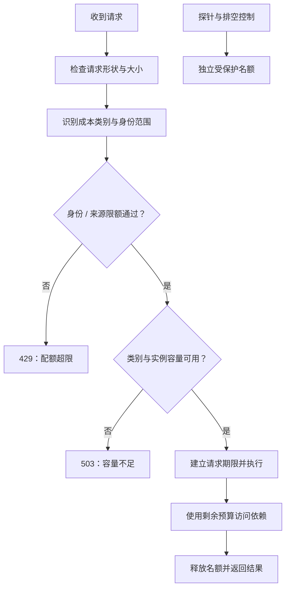

### 4.2 必须成立的约束

- 不采用“无限 goroutine 等连接”。需要等待时，等待人数和等待时间同时有上限；超期工作不进入下一层。
- 各实例名额的总和、滚动发布时的新旧实例和后台进程共同受依赖总预算约束。
- 静态预算按允许的最大实例数分配；增加实例前重新分配总预算。尚未建立动态预算协调时，不启用没有上限的自动扩容。
- 代理只自动重试明确安全的读取；业务写入使用 B3/B4 的幂等契约。不能因超时直接假设事务没有提交。
- 重试由一层负责，设置次数、退避和总期限，避免代理、客户端、数据库和消息消费同时放大请求。
- 现有 API 总并发阀与探针豁免继续使用；按类分配名额是目标设计，不能把现有总阀描述成已完成分类隔离。

## 5. B2：身份、用户与关注关系

B2 拥有用户、凭据、公开资料、角色和关注关系。身份校验、权限事实和页面上的个人状态是不同数据，不放进一个共享缓存对象。

业务和平台共用这套账号事实；账号与角色变更都进入 B2 的唯一领域命令入口。M9 提供认证授权的薄接口，调用 B2 的领域接口读取凭据/角色并结合各领域授权规则，不持有第二套身份库或角色写入逻辑。相同 B2 契约可以在不同进程中装配，语义所有权不等于必须部署一个独立身份服务。

- 普通业务沿用已有身份凭据校验。管理授权继续依据当前角色事实；共享资料缓存不替代权限判断。
- 注册和登录单独约束密码计算并发。攻击或短时登录峰值不能抢光详情与写入的 CPU。
- 资料批量读取支持 B5 页面装配；只公开必要字段，密码摘要、凭据和权限状态不进入公共投影。
- 关注命令表达“建立关系”或“移除关系”，唯一约束是最终事实边界。同一关系的相反命令需要定义提交顺序；跨关系操作不默认共享一个用户级排他锁。
- 当前关注实现锁定发起用户整行，属于可解释的串行保护；目标应缩小到关系转换所需边界，并验证并发建立、取消和用户生命周期竞态。
- 关注流的生成由 B5 负责，B2 提供关系事实与批量查询。B2 不承担每次发帖向所有粉丝扇出的工作。

**故障与完成条件：**角色事实不可取得时，管理操作拒绝执行；公开资料不能通过缓存泄露私有字段；关系重试不会产生重复事实或重复转换事件。是否支持即时会话撤销属于独立身份契约，不因扩容而凭空承诺。

## 6. B3：内容、评论与删除生命周期

### 6.1 事实与事务

B3 拥有内容事实和可见性状态。发布、编辑和评论成功，表示相应事实及必要的异步意图已在 MySQL 中提交；不表示搜索已可见或通知已生成。

目标事务只包括权限/父状态校验、事实变更、必要的幂等结果和 Outbox。事务中不执行 Redis、RabbitMQ、ES 请求或等待重建任务。

| 操作 | 必须同步完成 | 可以异步完成 |
| --- | --- | --- |
| 发布 | 内容事实、命令幂等结果、内容创建事件 | 搜索投影、缓存预热 |
| 编辑 | 作者校验、内容变更、单调版本、更新事件 | 搜索与缓存投影更新 |
| 评论 | 父内容可交互、评论事实、完整事实事件 | 通知与展示统计 |
| 删除 | 权限、不可见状态、持久删除版本、删除事件 | 关联记录清理、索引清理、缓存回收 |

### 6.2 超时与命令幂等

发帖和评论不是天然可安全重放的请求。目标为这类创建命令提供幂等键，作用域包含用户、命令类型和键，并绑定规范化请求摘要。

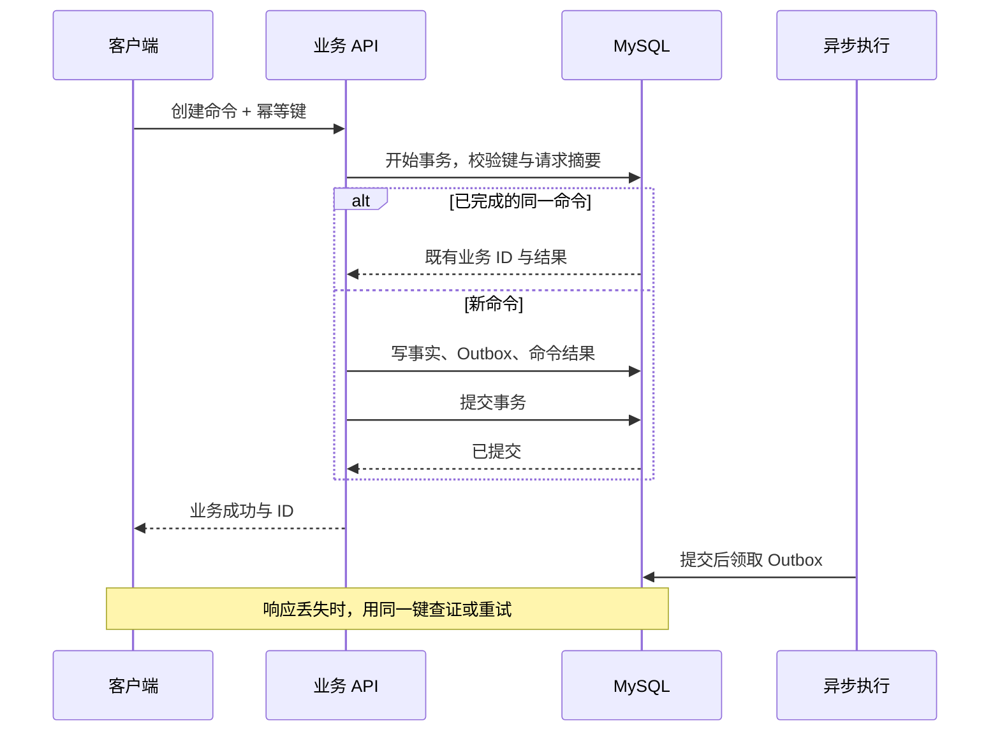

- 同键、不同请求摘要返回冲突，不能复用旧结果。
- 幂等结果与业务事实同事务提交，不能仅依赖 Redis 的短期锁。
- 数据库提交结果未知时，不返回“确定未执行”；客户端以同一键查证。
- 幂等保留窗口必须覆盖约定的重试与恢复窗口。窗口过期后的新执行风险需要在 API 契约中说明，不能承诺永久的全局“只执行一次”。
- 重试仍校验调用者身份，不把持久化响应变成绕过授权的入口。

### 6.3 编辑冲突与父资源锁

同一帖子的编辑、删除需要排他保护和单调版本。这一串行边界有业务必要。若两个编辑不能允许后提交者覆盖前者，应增加期望版本条件；这是公开编辑契约的变化，不能作为内部优化偷偷加入。

评论与独立交互只需要确认父内容仍可交互。目标使用短事务内的共享父状态保护，并在物理清理前阻止新的子事实。共享锁允许多个独立子写入并行，但仍会与编辑、删除的排他锁争用，也可能产生死锁；必须规定锁顺序和有界失败处理。[MySQL 锁定读文档](https://dev.mysql.com/doc/refman/8.4/en/innodb-locking-reads.html)支持共享父记录保护，不能据此保证本项目吞吐已提高。

### 6.4 业务删除与物理回收

目标将帖子生命周期定义为：

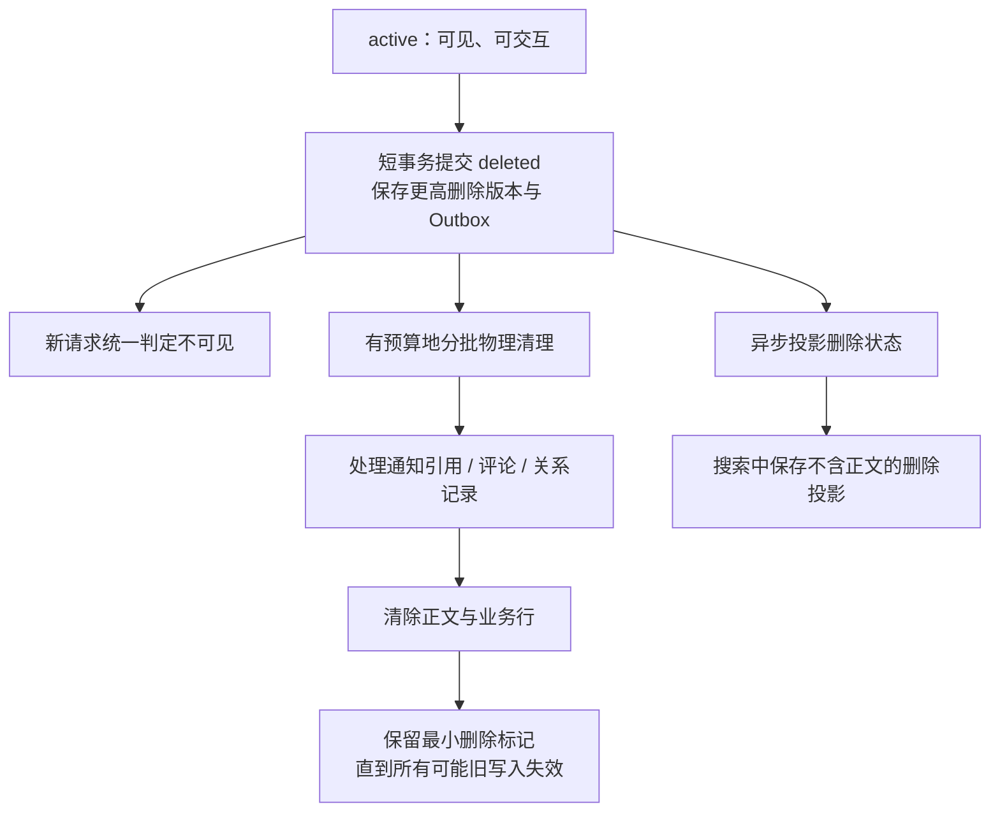

外部契约：删除成功后开始的请求，不能返回该内容或创建新交互；与删除重叠、已经开始的读取允许按其事实读取时点完成。若产品要求更强的撤回语义，应另行定义，而不是默认宣称跨系统线性一致。

删除事务只转换状态，工作量不随评论和点赞数量线性增加。后台清理按批量、连接、锁时间和磁盘预算运行，可中断、续跑和校准。通知在清理前也必须展示“资源已删除”，不能等待物理外键置空后才遮蔽。

这会改变当前“删除接口完成物理删除”的内部生命周期，必须作为正式合同变化审查。正文清理期限、失败升级、备份中的留存规则和删除标记保留期都需要明确；不能因为对外不可见就宣称已完成数据擦除。

**完成条件：**发帖/评论重试没有额外事实；编辑与删除竞态不越权、不丢版本；删除不等待整个索引重建；物理回收不会产生重复业务事件或复活内容。未经这些验证，不能直接删除现有保护锁。

## 7. B4：点赞、收藏与热门对象写入

### 7.1 事实边界

交互事实以“用户 + 内容 + 类型”为边界。一个用户对一篇帖子只能有一条点赞或收藏事实；是否发生了真实状态转换由唯一约束与事务决定。公共点赞数是投影，个人是否点赞是事实，两者不共享同一个写入热点。

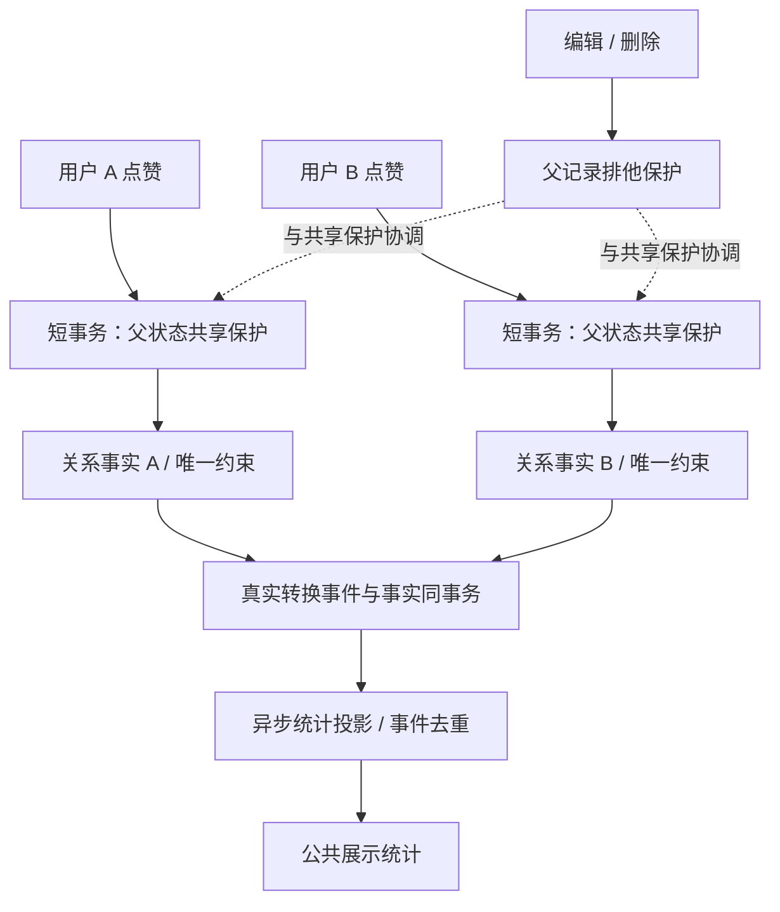

- 热门帖子上的不同用户交互不再默认获取同一父排他锁。此处是目标方案，当前代码仍采用排他锁。
- 收藏属于个人数据，不广播给其他用户，也不产生没有消费者的公共事件。
- 对同一关系的建立、取消和重复请求定义实际状态转换顺序。重复 PUT 的幂等性，不表示一个延迟到达的旧命令可以安全覆盖较新的 DELETE；涉及相反命令时，命令 ID 或期望关系版本需要进入公开契约。
- 不把当前不存在的“每次点赞同步更新帖子总计数”加入主事务，避免重新制造同一个热门行。
- 对识别出的热门对象限制在途写入与锁等待，为其他对象保留类别余量。热点跟踪集合本身有容量和过期上限，实例配额计入部署总预算；未识别热点仍受类别总阀保护，不承诺任意对抗流量下的绝对公平。

### 7.2 完整事实事件与统计

现有部分事件为通知而产生：自己的评论/点赞不通知自己，取消操作也没有对应的完整事件。因此，现有通知事件不能直接被当作全量统计变更流。

目标将事实事件与通知策略分开：

| 事实变化 | 统计需要 | 通知需要 |
| --- | --- | --- |
| 新评论，包括自己的评论 | 必须计入 | 由通知策略决定 |
| 点赞首次建立 | 计入一次 +1 | 可通知作者 |
| 点赞真实取消 | 计入一次 -1 | 不必生成新的通知 |
| 同一命令重复成功 | 不重复计入 | 不重复通知 |
| 收藏变化 | 个人关系事实；按实际需求投影 | 不向作者透露收藏 |
| 内容删除后的物理清理 | 已删除内容不可展示，不重复解释为用户取消 | 不产生新业务通知 |

统计投影必须能从事实校准。采用增量计数时，事件去重与计数更新要原子提交；不能用“先记录已处理，再加计数”的两个提交。乱序增减、重放和计数重建必须有明确规则，不能把暂时负数简单截成零后声称正确。

普通对象先使用简单统计存储。只有测出单个统计行争用时才采用稳定分桶，展示读取合并桶值；分桶增加读放大和校准成本。它不能解决同一用户关系的串行要求，也不能保证一篇无限热门内容拥有无限写入能力。

**完成条件：**并发交互不产生重复关系、重复计数或额外通知；父内容删除后不再建立关系；热点对象的锁等待不会耗尽无关业务的所有名额。

## 8. B5：页面读取、缓存与关注流

### 8.1 读取模型分层

一个页面由不同一致性的数据组装：

| 组成 | 来源 | 目标一致性 | 缓存规则 |
| --- | --- | --- | --- |
| 内容可见性、内容版本 | MySQL 权威事实 | 删除和编辑后的新请求使用当前事实 | 不用可失效的公共缓存替代 |
| 正文、公开作者字段 | 版本化公共投影 | 与通过校验的版本匹配 | 正文按内容版本存储；作者另按资料版本/刷新策略处理 |
| 点赞/评论展示计数 | 可校准统计投影 | 明确的有界延迟 | 独立于正文；携带或可追溯更新状态 |
| 个人点赞、收藏、关注 | 用户作用域事实 | 本人写入后的读取可查证 | 批量读取；不写入跨用户共享正文缓存 |
| 列表排序与搜索排名 | 候选集合 | 按公开分页和排序契约 | 不宣称所有分页天然是同一快照 |

当前列表执行数据库计数，详情计数依赖整份缓存失效；缓存失效失败和并发回填不会因内容版本校验而自动消除统计陈旧。目标统一统计语义是公开读取合同的变化，须正式确定可容忍延迟 `D_count` 和超预算表现，不能直接称现有计数为强一致。

### 8.2 正文读取与缓存重建

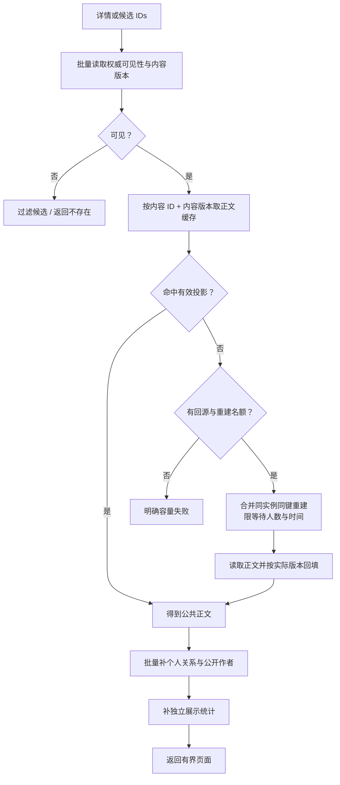

架构约束：

- Redis 失败后只允许预算内回源，不能让所有缓存请求一起涌入 MySQL。
- 同实例同键请求可以合并；多个实例各自最多产生有限重建。不默认引入分布式锁，跨实例重复回填只要有界且版本安全即可。
- 版本进入正文缓存键，旧回填不会覆盖新版本正文。权威可见性仍防止已删除正文被返回。
- 热门点赞和评论更新统计，不删除未变化的正文。TTL 抖动、受控预热和请求合并用于降低突发回源。
- MySQL 与 Redis 不原子提交。缓存键设计、失效消息或 Lua 操作均不能单独证明跨系统强一致。
- 每页装配按批量接口完成，避免按帖子循环查询作者、收藏和关注。并行批量读也需要连接预算，不以无限并行替代 N+1。
- 不在权威库不可用时悄悄返回未经可见性校验的缓存正文。这是所选删除契约的可用性代价。

### 8.3 列表与关注流

保留已有 keyset 游标，明确排序键、过滤范围、游标版本和页大小上限。游标分页降低深页跳过成本，但相关计数、过滤和候选扫描仍可能昂贵。

默认关注流继续采用读时生成：使用关注关系与作者索引获得候选，再统一装配。限定每次候选扫描、补页轮次和总耗时；高稀疏度、关注人数大、作者大量发帖是独立测试场景。

只有实测证明读时生成超过预算、且确实需要低延迟个人流时，才引入收件箱式投影。届时需选择推、拉或混合策略，明确新关注的历史内容、取消关注、热门作者扇出和删除过滤。当前不把“每个帖子给所有粉丝写一份”设为基础架构。

**完成条件：**缓存命中路径的数据库访问可数、可限；冷缓存不会击穿整个实例组；列表工作量有上限；同一内容对不同用户没有个人状态串用；统计陈旧超出约定时可以识别。

## 9. B6：可靠事件与异步执行

### 9.1 三个完成边界

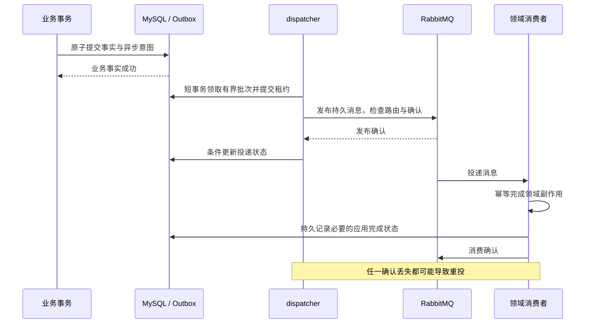

业务事实成功、Broker 接收成功、消费者应用完成是三个不同状态。当前 Outbox 租约、条件更新和至少一次投递已经是有价值的基础，继续保留。

### 9.2 队列与工作预算

按副作用分配独立队列和消费预算：通知、搜索、采用后的统计，以及维护/重放任务。每类明确处理并发 `W_j`、在途上限 `F_j`、单条期限、重试次数、失败队列和恢复余量。

- Prefetch 是未确认投递窗口，不等于实际处理并发。两者分别配置，避免大量消息停留在消费者内存。[RabbitMQ Consumer Prefetch](https://www.rabbitmq.com/docs/consumer-prefetch)是协议依据。
- 消费失败先确认重试/失败消息已可靠接收，再确认原消息；继续保留现有这一顺序。
- 不对同一失败消息立即反复 requeue。重试有退避、抖动、次数和总年龄上限。
- Outbox 领取事务在网络发布前结束。批次、发布期限和租约必须匹配；租约丢失后不得伪造完成。
- 扩消费者前检查其数据库和外部依赖预算。更多 worker 可能只增加池等待和重试。
- 不依赖整个队列全局有序。内容投影依赖单调版本；关系转换、计数和通知分别定义幂等规则。

### 9.3 事件契约

关联字段采用可观测篇第 5.1 节的共同定义：目标事实事件包含 `data_epoch`、`event_id`、类型与模式版本、`object_id`、发生时间、`command_id`，以及适用的 `object_version` 或状态转换信息。内容版本只用于内容，不通过“每次互动增加帖子版本”制造新的全局热点。

同一命令重试保持命令身份，同一事件重投与同代际重放保持事件身份。必要应用完成记录关联数据代际、事件、`consumer_id` 及适用的 `projection_generation`，同时保留路由契约修订；旧索引代际的完成不能证明新索引已完成。

通知是否生成是消费策略，不决定事实事件是否存在。事件默认传必要标识与最小数据；涉及删除的正文不能因历史消息重放重新进入索引。缓存键空间、数据集、事件和索引元数据需要核对同一数据代际，实验重置或恢复后拒绝旧代际事件，保留有界拒绝证据，不执行其副作用。

`experiment_id` 用于关联某次实验请求及证据，不替代数据代际，也不参与业务幂等和对象版本比较。同一数据代际可以运行多次实验；一次在线索引重建只改变投影代际。逐请求、命令、事件、对象、实验和 Trace ID 不进入普通指标标签。

### 9.4 恢复不能只盯着发布状态

现有 `published` 状态表示消息已投递，不表示所有副作用已经完成。目标需要为承诺必达的副作用保存应用完成依据：

- 通知记录的事件唯一键与应用完成记录可在同一 MySQL 事务里持久化。
- 搜索写入完成后再记录完成；两者不原子，崩溃后按版本安全重试。
- 事实事件在必要目标完成前不因为“已发布”而被清除。完成后再按约定重放窗口保留；消费者集合与路由版本要可追溯。
- 当前状态的搜索、缓存和统计可以重新构建；历史通知不能仅由最新点赞/关注状态推导出来。两类恢复能力要分开承诺。
- 完成记录增加数据库写入与留存成本，要纳入 B9 预算。它不是一套通用工作流平台，只跟踪本项目实际承诺的副作用。

Broker 停止、消费者长期失败和重放都会增加持久积压。Outbox、未完成任务和磁盘设软水位与停止接收水位；即将超过保留能力时，拒绝新的受影响写入，不能继续成功后悄悄丢弃异步意图。阈值必须预留已经准入的事务、采样延迟和最大事件大小。

**完成条件：**发布确认丢失、消费确认丢失、进程重启均允许重投，但没有额外事实或重复通知；故障恢复能定位未完成副作用；重放不耗尽在线业务预算。

## 10. B7：搜索查询、索引投影与重建

### 10.1 查询与事实边界

ES 返回候选 ID 和排序信息，B5 根据当前事实过滤并装配。搜索可以落后于发布和编辑，不能决定帖子是否存在、是否删除以及个人关系。沿用已有 PIT、代际绑定、游标校验和最大扫描轮次。

ES 故障只使搜索不可用；不能默认改为 MySQL 全表模糊搜索，因为这可能把故障转移到事实库。

### 10.2 去掉跨系统持锁前，必须有版本与删除屏障

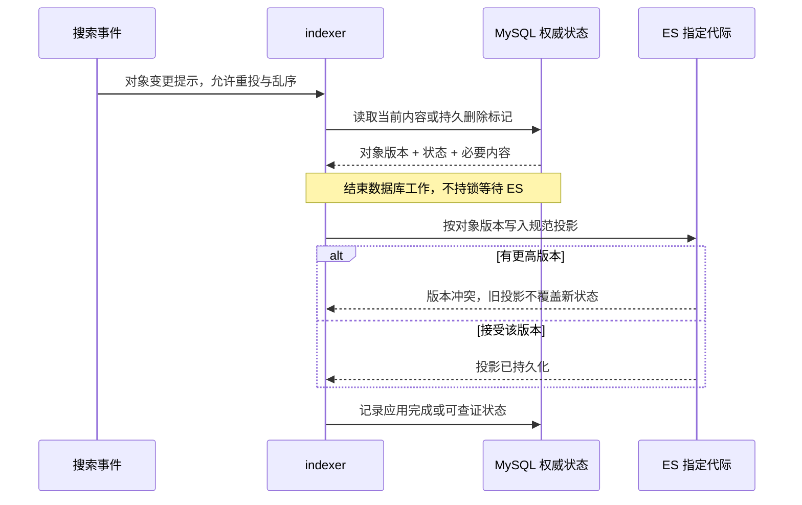

选择的目标机制：

1. 编辑与删除共享对象的单调版本空间。删除必须有比已发布内容更高的版本。
2. MySQL 保留最小删除标记，ES 保留不含正文的删除投影，并在查询中排除。
3. 同一代际、同一版本的投影必须规范且确定；版本冲突只能按已定义的版本语义处理，不能将任何 409 都当作成功。
4. 构建新索引时也携带删除标记和对象版本，旧快照不能覆盖更高删除版本。
5. 删除投影与标记只在所有可能的旧消息、旧构建任务和旧写入都已失效后回收。

[ES 外部版本 API](https://www.elastic.co/docs/api/doc/elasticsearch/operation/operation-index)说明了版本比较规则；[删除 API](https://www.elastic.co/docs/api/doc/elasticsearch/operation/operation-delete)说明删除版本只保留有限时间。因此，仅调用物理 DELETE 或提高 `gc_deletes`，不能证明任意长延迟重放不会复活内容。上述持久删除设计是本文的选择，需要实际竞态验证。

### 10.3 在线重建的具体机制

目标复用现有 RabbitMQ 和索引代际，不默认增加 CDC 平台：

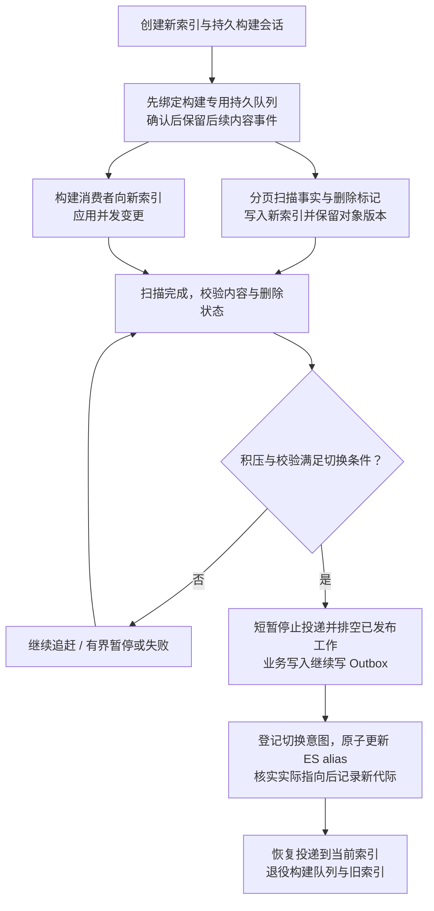

成立条件与失败处理：

- 构建队列在扫描前绑定，捕获之后发布的所有相关事件，包括迟提交事务的事件。已在绑定前发布的事实已经提交，可由扫描覆盖。
- 扫描的最大帖子 ID 只限定扫描范围，不代表提交顺序；不能拿 `MAX(outbox.id)` 当作无遗漏的提交水位。
- 扫描与实时投影都使用对象版本。扫描可以分批进行，不为整个重建持有业务排他锁。
- 切换前暂停的是消息投递，不是业务事实写入。新增事实进入 Outbox，切换后继续处理；暂停时长和积压有上限。
- “队列空”需包含未确认工作和正在执行的写入，不能只看 ready 消息数。
- 构建队列丢失、事件捕获中断或无法证明覆盖时，会话进入失败/待恢复状态；不能仅因索引数量相等就继续切换。
- ES alias 更新与 MySQL 会话状态不是一个事务。会话保存切换意图，失败后读取实际 alias 判定恢复方向；不能自动猜测并删除可能仍在使用的索引。
- 新代际正式使用前完成内容、版本和删除校验；不只比较数量。切换会使已有代际游标按契约失效。
- 在上述捕获、追赶和恢复机制实现并通过竞态验证前，现有重建/删除保护继续成立，不能先撤锁。

**完成条件：**并发创建、编辑、删除、迟提交、乱序重投和重建切换不会遗漏最终事实或复活删除内容；搜索变慢不延长内容写入的行锁。

## 11. B8：通知与个人消息状态

通知是领域数据，RabbitMQ 是执行媒介。用户能查看的通知必须持久化在 MySQL 中，消息确认不替代通知事实。

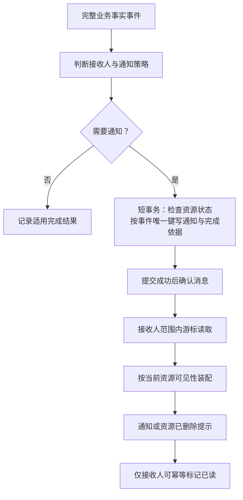

- 保留现有事件 ID 唯一约束和接收人范围内的已读更新。若以后一个事件通知多人，唯一范围需要包含接收人，不能沿用单接收人的假设。
- 一篇帖子收到大量点赞时，通知写入也会形成负载。按接收人提供查询索引和消费预算，不在作者记录上同步更新一个必争用总计数。
- 通知记录表示历史发生，不将后来取消点赞自动解释为“历史通知不存在”。需要合并展示时保留源事实依据，不把多个事件当作一个不可恢复的大 JSON。
- 删除后到达的事件也只能生成删除状态的通知；读取时遮蔽已删除引用，物理回收后仍保留可解释的通知形状。
- 未读数量若采用派生值，需要单独的一致性与校准契约；不以每次列表扫描所有历史通知作为默认高并发方案。
- 消费异常不会阻塞发帖与互动的同步事务，但必须反映到未完成任务、持久空间水位与恢复预算。

**完成条件：**重复投递只有一个通知结果；资源删除前后到达的事件不暴露正文；用户不能读取或标记他人的通知；处理积压时在线读取仍有保留资源。

## 12. B9：数据访问、持久化与恢复

### 12.1 数据归属

| 数据 | 语义所有者 | 存储属性 | 恢复方式 |
| --- | --- | --- | --- |
| 用户、角色、关注 | B2 | 权威事实 | 业务数据库恢复 |
| 内容、评论、删除标记 | B3 | 权威事实与生命周期屏障 | 业务数据库恢复 |
| 点赞、收藏 | B4 | 权威关系事实 | 业务数据库恢复 |
| 命令幂等结果 | 对应命令模块 | 重试合同的一部分 | 与事实一致恢复 |
| Outbox、必要应用完成记录 | B6 | 可靠执行依据 | 持久保留、查证与重放 |
| 通知、已读状态 | B8 | 用户可见的持久数据 | 业务数据库恢复 |
| 统计与信息流投影 | B5 | 可校准派生数据 | 从事实/可靠事件重建 |
| 正文缓存 | B5 | 可丢弃加速数据 | 按版本回填 |
| 搜索投影与代际会话 | B7 | 索引可重建，会话需查证 | 从事实与删除标记重建 |

B9 不取得所有领域写权限。各领域通过自己的 Repository 改变事实；B9 提供连接、期限、索引和生命周期约束。读取装配可以批量查询领域公开字段，不能因此变成跨模块任意写表的服务。M9 通过 B2 领域接口访问账号/角色，M6 通过业务只读状态接口诊断，都不因此获得跨表写入权。

### 12.2 连接与事务预算

当前单个 Backend 默认 HTTP 并发上限为 128，应用数据库池默认最大连接为 10。这是配置事实，不代表 128 个请求都能立即访问数据库。worker、indexer、新旧滚动实例和维护任务都增加总连接需求。

定义：

- `N_r`：运行角色 r 同时存在的实例数，包含滚动发布重叠实例。
- `P_r`：该角色每实例所有连接池的最大连接之和。
- `C_reserve`：探针、迁移、诊断和必要恢复预留。
- `C_safe`：数据库在选定硬件与负载下验证出的安全连接预算。

必须满足：

```text
Σ(N_r × P_r) + C_reserve ≤ C_safe
```

这个求和覆盖访问同一物理数据库的全部角色：业务 API、dispatcher、消费者、平台身份读取、平台元数据、诊断、滚动实例和维护。诊断若使用显式独立池，计入对应 `P_r`；若使用预留名额，计入 `C_reserve`，不能两处重复计数。B10 申报业务份额，平台模块申报自身份额，M8 在环境资源合同中校验总量。物理数据库分离后分别建立预算，不把同一实例的多个 schema 当作独立容量。

`C_safe` 不能直接等同于 MySQL 的 `max_connections`。连接数未到上限时，CPU、IOPS、日志刷盘或行锁也可能先饱和。

进程内先以请求类别名额和 Repository 边界隔离成本。只有确实需要硬连接保留时才拆多个有限连接池，所有池仍计入上式；否则“读池 + 写池 + 后台池”可能只是无意中增加总连接。

请求包含多次数据库访问，连接占用需要按实际路径测量。若 `λ_i` 是第 i 类到达率，`d_i` 是每个请求所有访问累计的连接持有秒数，则稳定状态下：

```text
平均活跃数据库连接 ≈ Σ(λ_i × d_i)
```

这是平均占用估计，不保证尾延迟或突发容量。长事务、锁等待和嵌套借连接会增大 `d_i`。应先减少无效扫描和事务持有时间，再讨论增加连接。

### 12.3 查询与存储契约

- 对详情、主页列表、作者列表、关注流、收藏列表、评论列表和通知列表分别定义过滤、排序、索引和最多扫描工作量。
- 查询索引围绕真实路径，例如作者列表需要作者与排序键组合；不把现有单列索引直接称为所有访问形态都最优。
- 使用查询计划与代表性数据验证，不能由 SQL 外形、`FORCE INDEX` 或游标存在推断恒定成本。
- Outbox、幂等结果、通知、统计去重和删除标记各有保留规则，防止无限增长。不能为了节约空间提前破坏恢复合同。
- 普通事务固定锁顺序、最大持有时间和死锁处置。对可证明未提交的可重试错误作有界重试；未知提交走命令查证。
- 备份覆盖事实、执行依据和删除状态；恢复后重建派生数据。只备份帖子表不是完整业务恢复。

### 12.4 读副本、分片和高可用的边界

读副本用于允许延迟的候选、公开资料等读取。本人写后查证、当前权限和删除可见性仍需权威路径，或正式建立具有证明的复制进度协议。引入副本不自动让详情成为零主库访问。

分片只有在单库经过查询/事务优化后仍达不到容量合同时才进入设计。届时内容及其评论/互动适合围绕内容 ID 讨论局部性，通知围绕接收人，关系围绕用户；这些选择会产生跨分片读取和事务问题，不能只写一个“按用户 ID 分片”就结束。

基础部署允许单主库，必须诚实记录其可用性与恢复点。若选择故障切换，则需要复制、旧主写入隔离、恢复点和切换协议；多部署一个数据库容器不能构成已证明的高可用。

恢复到过去的数据点时，旧缓存、旧搜索版本和旧环境消息不能直接继续覆盖恢复后的事实。M8 协调建立新的持久 `data_epoch`，B9 的恢复入口验证事实、执行依据和派生存储的代际，B6 消费者核对事件代际。事实恢复、缓存/索引切换和受控重放通过后才恢复相应准入，并核实删除标记，避免因版本倒退而使用错误投影。恢复重放需要按新代际的恢复合同生成执行依据，不能仅给旧消息更换标签。

**完成条件：**连接预算在扩容、发布和恢复期间仍成立；权威数据恢复后可以解释异步任务和删除状态；派生存储丢失可在预算内重建。

## 13. B10：容量契约、发布与运行生命周期

### 13.1 容量合同

B10 定义业务容量目标，提供并验证业务准入、连接、消费、重建和维护预算，由 B1–B9 及各业务进程执行。M8 汇总这些预算与 M2–M7 的观测预算，维护版本化的整体环境资源合同，组织负载、故障、恢复和原始结果归档；B10 不另建实验编排器或平台预算控制器。

业务容量结论引用 M8 冻结的环境合同修订、实验 ID 和原始结果。该合同绑定代码与配置版本、数据代际、实例数量与发布重叠、CPU/内存/磁盘、共享依赖总预算、数据规模、对象热点分布、操作比例、请求体/页大小、缓存状态、依赖部署方式和测量窗口。观测开销属于实验条件，不能只固定业务资源而让平台开销无上限。

M8 经各模块配置入口应用合同，B10 校验业务份额与生效修订。普通请求继续使用有效配置，不同步依赖 M8；实验声明与实际配置不一致时，不能将测量结果归入该合同的容量结论。变更预算需重新验证共享总量，不能以增加 API 实例自动增加数据库总连接。

每类请求定义延迟目标 `L_i`、期限 `T_i`、容忍失败与拒绝比例；异步链路定义新鲜度 `D_j`、允许积压与恢复时间；删除定义对外生效与物理清理期限。这些是需要正式赋值的合同参数，不是本轮已经测得的 SLO。

本轮没有生产需求和受控压测结果，不能诚实地给出固定可达 QPS。架构的容量产物应是每个指定场景的可持续 goodput、尾延迟、首个限制资源和故障恢复范围，而不是所有场景共享一个宣传数字。

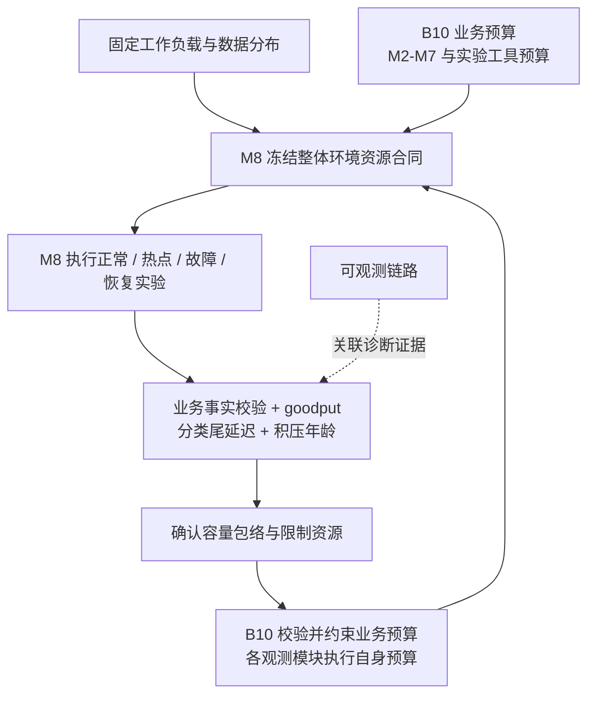

### 13.2 发布与兼容性

部署需要区分当前可读版本、可写版本、事件版本和已启用生命周期。

| 变化 | 上线约束 | 回退约束 |
| --- | --- | --- |
| 增加删除状态与标记 | 所有读取、互动、通知和索引消费者先理解删除状态，再启用逻辑删除 | 存在逻辑删除数据后，不能直接退回会忽略状态的旧读取版本 |
| 补齐完整事实事件 | 相应消费者理解新类型/模式，未知事件持久停放并可诊断 | 不能丢弃旧版本暂时无法识别的必要事件 |
| 从整份缓存改为分层读模型 | 新旧键空间与统计语义明确，可回源 | 回退不能混用含个人字段或不同计数合同的值 |
| 启用统计投影 | 完整转换流、初始基线、去重与校准先成立 | 不因部分部署只处理 +1 就切换计数来源 |
| 切换索引代际 | 事实/删除校验、会话恢复与游标规则成立 | 旧索引仍使用时不能回收，回退也需处理期间发生的删除 |
| 调整进程数量与连接池 | 按发布重叠量重算整体预算 | 不沿用只覆盖稳态实例数的配置 |

这些是顶层兼容约束，不是新的实施批次分配。

### 13.3 排空与维护

- API 排空先停止新工作并退出就绪，再在有界期限内完成已准入请求；未确定提交的命令保留查证依据。
- worker 停止领取新消息，完成已领取工作或保留未确认投递；dispatcher 保留租约事实，恢复时条件领取。
- 内容回收、Outbox 清理、统计校准和搜索重建独立设置连接、批量与时间预算；在线容量不足时让出资源。
- 启动与就绪检查按角色判断必要依赖。目标 business-api 不把可降级的缓存、搜索或可观测系统当成所有业务的强制启动条件；消息系统短时不可用能否启动取决于 Outbox 剩余容量及运行模式。
- 现有 Backend 同时组装业务、平台查询和 dispatcher，部署启动也依赖多项系统。上述隔离是目标改变，不能仅靠改健康检查绕过缺失的运行模式。

### 13.4 与可观测系统的接口

可观测链路接收请求关联、事实提交、事件投递、投影完成、失败原因和有限资源状态。容量结论必须同时包含业务事实校验与测量结果；日志数量或 Trace 数量不能证明业务正确。

业务提供有预算的只读状态接口，由各领域模块返回其拥有的持久事实，供 M6 关联、M7 展示。查询按数据代际与命令、事件或对象限定范围，返回提交结果、Outbox 投递状态、适用消费者/投影代际的完成记录、失败尝试及各项记录/读取时间；B7 按需提供指定索引代际的受限可见性检查。状态接口复用模块边界，不允许平台直接扫描业务表，也不增加普通事务等待遥测的条件。

这些状态不构成跨 MySQL、RabbitMQ 和 ES 的原子快照。“尚未持久确认发布”不能证明 Broker 从未收到；一次失败不能证明后续没有成功；没有应用完成记录不能证明搜索尚未写入。记录超出保留窗口、后端不可用、关联版本不匹配时返回明确缺口。M6 分别标注持久事实与遥测，M7 保留未知；缺少日志或 Span 不能判定业务阶段未发生。

遥测输出有有限缓冲与失败策略。它不能持有业务事务，也不能因诊断数据积压阻塞普通业务。平台诊断查询有独立预算，实验故障注入必须按受控范围运行。本轮仅设计这些接口，没有执行故障注入。

**完成条件：**发布期间不越过数据与事件兼容边界；新旧进程共同遵守资源预算；维护和恢复不会挤占全部前台容量。

## 14. 跨模块一致性与故障合同

### 14.1 一致性按数据定义

| 对象 | 推荐合同 | 需要避免的误解 |
| --- | --- | --- |
| 帖子、评论、个人关系 | 成功对应权威事实提交；创建重试可查证 | 缓存写入或消息发送不是业务提交 |
| 编辑内容与版本 | 新请求按当前版本读取，冲突行为明确 | 多请求同时执行不表示可以忽略版本 |
| 删除 | 删除后开始的新读/互动被统一遮蔽；物理回收有单独期限 | 索引尚未删除不表示内容仍可访问 |
| 展示统计 | 明确有界延迟、陈旧表现与校准 | 内容版本不能证明计数新鲜 |
| 搜索 | 最终投影、有限新鲜度、事实回源过滤 | 搜索排名快照不是业务事实快照 |
| 通知 | 异步但持久、事件幂等、接收人隔离 | Broker 发布确认不是通知必达证明 |

表中的目标合同需要正式纳入后续实施验收；本文不默默改变当前接口的完成语义。

### 14.2 故障时如何守住边界

| 情况 | 同步业务 | 异步/维护行为 | 恢复限制 |
| --- | --- | --- | --- |
| Redis 不可用或冷启动 | 预算内回源；超出预算拒绝 | 停止无必要预热 | 不允许全量无限回源 |
| MySQL 不可用 | 不能完成事实校验或事实写入，明确失败 | 暂停依赖事实的消费 | 不用旧缓存伪装当前可见性 |
| RabbitMQ 不可用 | Outbox 安全水位内可以提交；超水位拒绝相关写入 | 投递退避，已接收意图保持持久 | 不跳过确认、不删除未完成意图 |
| ES 不可用或限流 | 常规业务继续；搜索独立失败 | 搜索消费退避、保留积压 | 不在持锁事务中等待 ES |
| 通知消费积压 | 事实写入正常至持久空间边界，通知读取有保留预算 | 受限追赶 | 不无限加 worker 或丢弃历史事件 |
| 热门内容持续写入 | 热点名额与锁等待有界，无关请求保留资源 | 统计按预算更新 | 拒绝率和公平性进入容量结论 |
| 搜索重建/物理清理占用资源 | 前台优先预算有效 | 限速、暂停或续跑 | 不要求用户删除等待全库维护 |
| 可观测系统故障 | 业务继续，遥测按合同丢弃/缓冲 | 诊断能力下降 | 不把业务事件当可丢遥测 |
| API/worker 崩溃 | 已提交事实不回滚；未知结果可查证 | 租约过期或消息重投 | 不依赖进程内状态决定是否已完成 |

## 15. 容量推导与证明方式

### 15.1 不能忽略的三个约束

稳定状态下，请求在途数约为到达率与平均处理时间的乘积：

```text
C_request ≈ λ × W
```

它用于估算在途需求，不用于保证 p99。平均时间变长时，维持相同流量需要更多资源；无限增加等待请求只会把问题藏到内存中。

若某热门对象的操作必须串行，临界区平均持有时间为 `t_hot`，则理想情况下该串行点的速率上限量级为：

```text
μ_hot ≤ 1 / t_hot
```

额外 API 实例不会消除这个共享串行点。共享父锁、缩短事务和移走外部 I/O 改善的是具体临界区；分片不能自动加速同一个热点键。

积压为 `B`，恢复期间新任务到达率为 `λ`，有效处理率为 `μ`，只有 `μ > λ` 时才能持续排空：

```text
T_drain ≈ B / (μ - λ)
```

例如，假设积压 60,000 条、有效消费 500 条/秒、新到达 300 条/秒，则理想净排空时间约 300 秒。这只是公式演示，不是 GoPulse 的测量结果；重试、共享数据库和突发都会使真实时间变长。

### 15.2 代表性负载与证据

| 场景 | 必须固定的条件 | 必须证明的结果 |
| --- | --- | --- |
| 均匀混合流量 | 操作比例、数据规模、页大小、实例资源 | 分类 goodput 与尾延迟，事实正确 |
| 热门正文读取 | 热点比例、不同访问用户、正文大小 | 缓存命中仍有界，个人状态无串用 |
| 热门内容交互 | 不同用户对少数内容操作、建立/取消比例 | 关系与统计正确，热点不拖垮无关业务 |
| 高稀疏关注流 | 关注数量、作者活跃分布、候选密度 | 扫描/补页工作有界，游标可解释 |
| 缓存冷启动或故障 | 冷键集合、持续到达率、回源名额 | 数据库不被回源压垮，拒绝可观测 |
| ES/RabbitMQ 降速或停止 | 故障时长、恢复速率、积压规模 | 常规业务隔离、意图保留、恢复可排空 |
| 并发编辑/删除/重建 | 对象版本、迟提交、重放和切换时点 | 无遗漏、无复活、无过期正文泄露 |
| 发布重叠与维护 | 新旧实例数、迁移/回收/重建预算 | 总连接与前台容量仍在合同范围内 |

负载发生器需保持计划到达率，并记录计划槽位、实际发出、工具丢弃、系统准入、拒绝、完成和业务成功。已有发生器可复用；工具侧资源不足的结果不能作为系统容量结论。[k6 开闭负载模型文档](https://grafana.com/docs/k6/latest/using-k6/scenarios/concepts/open-vs-closed/)解释了响应变慢时封闭模型降低到达率的测量风险。

延迟按请求类别及成功、拒绝、失败分别报告。goodput 只计符合业务语义与该类时间合同的成功工作；一秒内快速拒绝大量请求不能算成高业务吞吐。还需要报告积压年龄、正常流量下的恢复净速率和压测端资源。

## 16. 复用范围、条件扩展与设计终点

### 16.1 已有能力与目标改变

| 类别 | 保留的基础 | 目标改变 |
| --- | --- | --- |
| 业务领域 | 用户、帖子、评论、关系、搜索、通知 | 明确语义所有权、批量接口和一致性合同 |
| 事务可靠性 | 事实与 Outbox 同事务、租约领取、条件更新 | 补齐事实转换事件与必要副作用完成依据 |
| 交互写入 | 唯一关系约束 | 缩小父锁、明确相反命令与重试顺序 |
| 读取 | 公共投影与个人字段分离、keyset 游标 | 正文/统计/个人状态分层，工作量和回源有界 |
| 搜索 | 外部版本、PIT、代际游标、事实回源 | 持久删除版本、无跨系统持锁、可恢复在线重建 |
| 通知 | 事件去重、接收人作用域、幂等已读 | 与完整事实事件解耦，应用完成与删除遮蔽 |
| 运行 | 多副本、HTTP 总准入、独立通知/搜索进程 | 独立 dispatcher 与平台进程、全局预算和发布兼容 |

### 16.2 只有满足条件才增加的复杂度

| 扩展 | 触发依据 | 新增成本 |
| --- | --- | --- |
| 多级正文缓存 | Redis 或网络成为实测读限制，事实校验仍满足合同 | 跨实例陈旧与内存回收 |
| 统计分桶 | 单统计行出现明确争用 | 合并读、去重与校准 |
| 个人流收件箱/混合扇出 | 读时生成超过成本合同，产品需要相应体验 | 热门作者扇出、关系变化与历史回填 |
| 读副本 | 可延迟读取占主库资源，复制滞后可控制 | 写后读取、删除/权限校验与路由 |
| 数据分片/Vitess | 单库在已优化条件下仍达不到合同 | 跨分片关系、事务、迁移与恢复 |
| 独立领域微服务 | 模块有可验证的独立容量、团队或发布边界 | RPC 期限、分布式事务和数据副本 |
| 长连接推送 | 产品实际需要实时消息 | 连接网关、订阅状态和背压 |
| 多地域写入 | 已有明确地域与恢复需求 | 冲突、旧主隔离、数据一致性 |

**设计终点：**在固定资源与公开负载下，真实社区业务拥有可证明的事实正确性、容量包络、热点隔离和恢复边界；可观测系统能够解释这些结果。达到这一点后，继续添加中间件或业务品类并不自动增加项目价值。

## 17. 本次交付与尚未验证的部分

本文完成了目标模块、运行时边界、数据归属、主要业务流程、一致性合同、故障行为、容量公式与条件扩展设计。所有拟建设能力均为提案；源码检查只证明现有结构存在，不证明性能和竞态结果。

2026-10-05 对齐修订验证：12 个 Mermaid 图通过解析与实际渲染，变更的部署图和容量流程图完成视觉检查；17 处本地引用及适用行号均有效，章节与代码围栏结构检查通过。本轮没有修改应用代码、运行应用测试或执行性能/故障实验。

仍需在对应正式实施合同中赋值或验证的内容包括：实际负载与硬件、各类期限/延迟/拒绝预算、统计新鲜度、删除清理期限、事件/幂等/删除标记保留窗口、共享锁竞态、应用完成依据、重建捕获与切换恢复，以及容量/故障/恢复实测。它们是设计假设与验收边界，不是本轮已执行或已完成的工作。
